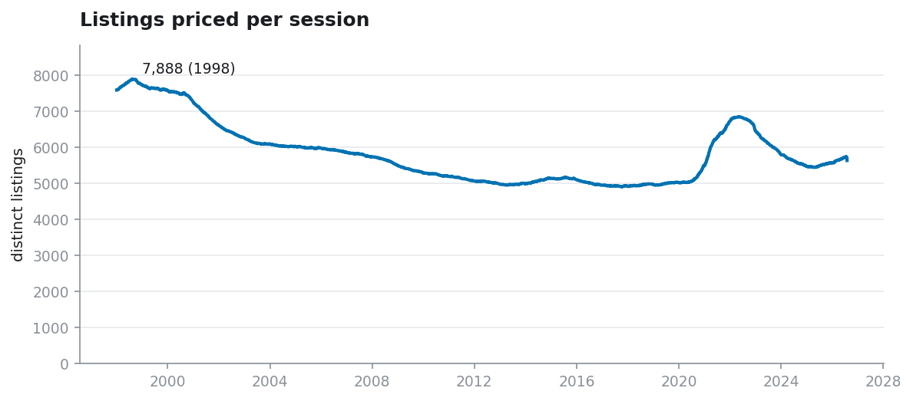
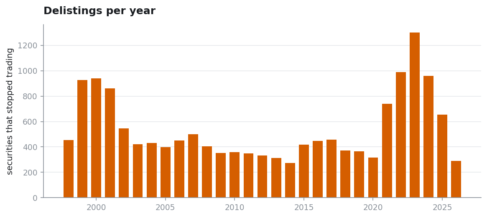
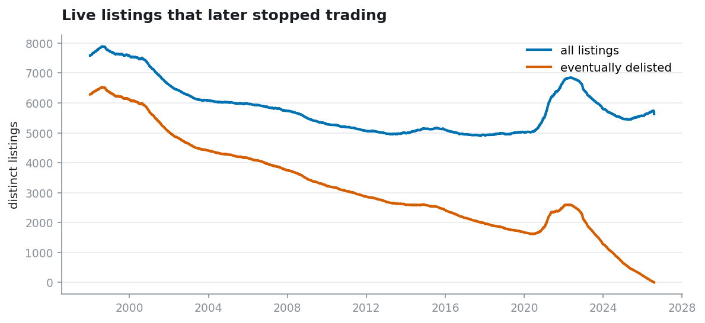
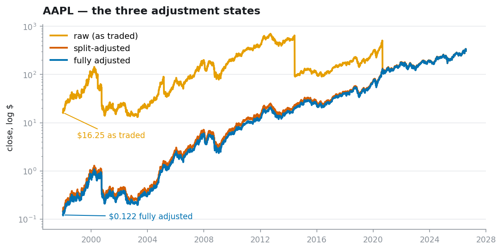
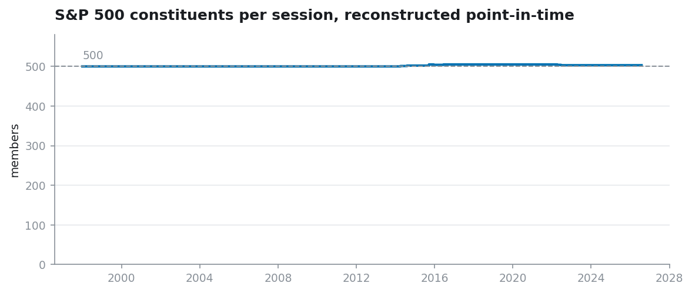
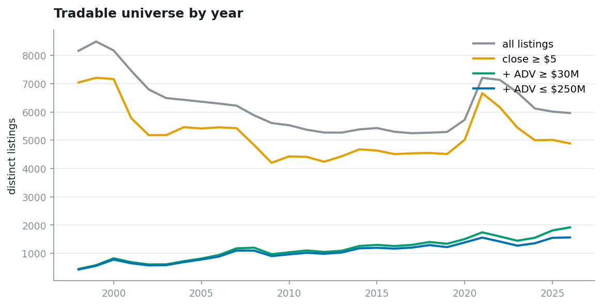

Before any of the modelling was worth doing, I had to build a dataset I actually trusted. This is
the second attempt. The first one — 27.7 million bars from a retail price API — I threw away, after
discovering that the survivorship fix I'd been relying on for months only worked for the last third
of the history.

This is what the rebuild took: 41.8 million daily bars from 1998 to 2026, and the five problems
that had to be closed to get there. Two I knew about going in. Two I found by accident. One I only
found because a chart looked wrong.

I'm writing this partly so I remember why the data is shaped the way it is, and partly because most
of these problems are invisible until they've already ruined a backtest.

---

## What's in it

|                       |                                                                |
| --------------------- | -------------------------------------------------------------- |
| Coverage              | 1998-01-02 to 2026-07-31, 7,188 trading sessions               |
| Rows                  | 41,804,033 daily bars                                          |
| Listings              | 19,023                                                          |
| Delisted listings     | 13,288 — **70% of the panel**                             |
| Securities tracked    | 21,936, of which 15,628 are delisted                           |
| Source                | [Sharadar](https://sharadar.com) — prices, corporate actions, metadata, index membership |



That curve is the first thing I check on any equity dataset, and it's the cheapest lie detector
there is. It should **fall** — 7,888 listings in 1998, down to a trough of 4,906 in 2017, then the
2021 SPAC spike, then down again. The US had far more listed companies in 1998 than today, and a
dataset that doesn't show that has quietly deleted everything that died.

My previous dataset rose toward the present. I looked at that chart for months without registering
what it meant.

---

## Why there was a second attempt

The first build used a retail market-data API. Its universe came from an "active tickers" list plus
a separate "delisted" endpoint, and I combined them in the right order, and wrote *survivorship
clean* in my notes, and moved on.

Then I plotted delistings by year. Almost nothing before 2015, then a wall of them from 2021.

That isn't what markets do. 2008 and 2009 should be visible from a mile away. So I checked the
delisted list directly: roughly 40 companies for 2002–2015, roughly 9,100 for 2016–2026. The list
effectively began in 2016.

A second test, from the other direction — of the names trading in a given year, how many were still
trading at the end of the panel? Roughly half of US listed companies disappear within a decade, so
old cohorts should show *low* survival:

| cohort | still trading at panel end |
| ------ | -------------------------- |
| 2004   | **71.5%**            |
| 2008   | 69.5%                      |
| 2012   | 67.3%                      |
| 2016   | 63.2%                      |
| 2022   | 56.1%                      |

71.5% survival over 22 years isn't believable, and the trend runs backwards: older cohorts survived
*more*, despite having more time to die. That only happens when the deaths are missing.

The lesson I took wasn't "that vendor is bad." It was that I had **checked survivorship, satisfied
myself, and moved on — without ever writing a test that could fail.** I caught it because a chart
looked wrong, which is not a process.

So the rebuild had one requirement above all others: every claim about the data has to be
falsifiable from the data itself.

---

## Problem 1: dead companies

If you download "all US stocks," you get the ones that still exist. Companies that went bankrupt,
got bought, or were kicked off the exchange are simply absent.

Backtest on that and your strategy **never once buys a stock that went to zero**. It picks only
from companies that made it — which is information nobody had at the time. Failure is a real
outcome, and deleting it from the sample makes everything look better than it was.

**13,288 of 19,023 listings here stop trading before the panel ends. 70% of the panel.** And they
are spread across the whole history, not bunched into recent years:



A median year sees 432 delistings, ranging from 274 (2014) to 1,299 (2023). That's a plausible
shape for US equities. The previous dataset had roughly 40 for an entire *decade*.

The same fact from the other side — how much of each session's universe eventually dies:



**82.7% of the listings trading in 1998 eventually stopped trading.** Still 60.0% for 2010. That
population — the one a survivor-only dataset silently removes — is the majority of the early panel,
not a footnote.

One artifact worth explaining: the red line falls to zero at the right edge. That's mechanical, not
a bug. A company still trading today isn't flagged as delisted *yet*, so as you approach the end of
the panel there's less and less future left in which to die.

### The test that would have caught it the first time

The single sharpest check I have is this: ask the dataset for the S&P 500 as it stood on
**12 September 2008** — the Friday before Lehman Brothers filed.

It returns 500 names. One of them is Lehman, with a real price bar at **$3.65**, which is what
Lehman actually closed at that day.

That one row is worth more than any summary statistic. A survivor-biased dataset physically cannot
produce it.

---

## Problem 2: recycled ticker symbols

Ticker symbols get reused. A company delists, its symbol returns to the pool, and years later
somebody else gets it. Stitch those together naively and one price series jumps between two
unrelated businesses — every moving average, return, and forward label spanning the join is
measuring nothing.

My first build handled this with a dormancy heuristic: more than 90 days without trading, and what
follows is treated as a different listing. It worked, but it was a guess, and anything joining by
ticker afterwards had to know about the synthetic suffixes.

The rebuild gets this for free, because the vendor solves it at the source. A reused symbol keeps
the *live* company on the clean ticker and gives the dead one a numeric suffix — Bear Stearns is
`BSC1`, not `BSC`. And every security carries a `permaticker`, a permanent id that survives ticker
changes, so history is rewired onto the new symbol rather than fragmented.

The heuristic is gone. That's ~40 lines of my code deleted and replaced by a vendor guarantee I can
check.

---

## Problem 3: things that aren't stocks

The universe contains a great deal that isn't a company: ETFs, closed-end funds, ETNs, commodity
trusts, warrants, units, preferred shares. Leave them in and your stock-picking model is partly
picking index funds.

My first build resolved every ticker to an SEC CIK and classified entities by what they *filed* —
a five-condition test, three-rung matching ladder, thousands of EDGAR requests, 2,075 listings still
unresolved at the end. It was the single largest piece of code in the pipeline, and it existed
because the price vendor shipped no usable security-type field.

The new source ships `category` and `exchange` as explicit metadata. The filter is a set membership
test. 19,665 of 21,936 securities are common stock or ADRs on a US exchange.

I'm noting this because it's the least glamorous kind of progress and probably the most valuable:
**most data-cleaning code exists to compensate for a missing field.** Getting the field deletes the
code.

There is one trap here that I nearly walked into. `exchange` is a **current** attribute, not a
point-in-time one. Fannie Mae and Freddie Mac were NYSE blue chips and S&P 500 members until 2010;
today they trade OTC. Filtering to major exchanges would have deleted their entire NYSE history —
discarding a company's past because of its later fate, which is precisely the bias I'm trying to
remove. The filter includes OTC deliberately.

---

## Problem 4: the adjusted price trap

This is the subtle one, and the one that changed my results the first time around.

Every vendor's "adjusted close" is **back-adjusted**. When a stock splits 2-for-1 the price halves
overnight — you didn't lose anything, you own twice as many shares — so vendors rewrite all the
earlier prices to keep the series continuous. Same for dividends.

This is necessary. Without it your returns are wrong.

**But the rewriting uses the future.** To know what Apple's 1998 price should be adjusted to, you
need every split and dividend from 1998 until today. The number stored for 1998 could not have been
known in 1998.

That's harmless when you take **differences**, because a return is a ratio and the adjustment factor
appears in both numerator and denominator. It is **not** harmless when you use the price on its own,
because every stock carries a different future factor.



Apple on 2 January 1998 traded at **$16.25**. Fully adjusted, that same bar reads **$0.122** — a
factor of 133, from 112× of splits and two decades of dividends.

Sort your universe by price and 1998 Apple sits among the penny stocks. And ask *why* its number is
so small: because it split 112× afterwards. Splits happen to stocks that went up.

> So "cheap" quietly becomes **"this stock was about to do well."** That's future information
> sitting in a column that looks like an ordinary price.

The amber line shows what actually happened on the tape, cliffs and all — those four drops are the
2000, 2005, 2014 and 2020 splits. The blue line is what a naive backtest sees. They converge at the
right edge exactly as they must, because the most recent bar has no future left to adjust for.

### What changed in the rebuild

Last time, reconstructing the real price was a project: download every split event, then multiply
each date by every split ratio dated after it, then validate four different ways.

This time the vendor ships all three states in the same row — split-adjusted OHLCV, a fully adjusted
close, and an unadjusted close. Two factors recover everything:

```
split_factor = close_split / close_raw       div_factor = close_adj / close_split
```

So the panel carries all three and nobody has to remember the algebra at the call site.

**And this time it's verifiable.** Corporate actions arrive as a separate table, so the price data
can be checked against an independent record of what happened:

| check | result |
| ----- | ------ |
| raw close == vendor unadjusted close | exact |
| adjusted close == vendor adjusted close | exact |
| split ratios agree with the actions table within 1% | **99.25%** of 9,728 matched splits |
| split ratios agree to floating-point exactness | **70.78%** |

The ~0.75% that disagree are mostly reverse splits the vendor logged but never applied to its own
prices. I know they exist, I know how many, and I know which tickers. On the previous dataset the
adjustment was a black box and this table could not have been produced at all.

### The thing that nearly slipped through

The naive split factor — just dividing adjusted close by raw close — is **noise**.

Prices are stored to three decimals. On a 1998 Apple bar whose adjusted close is $0.117, that's
0.4% of quantization, and the ratio wobbles every single day. On AAPL the "split factor" appears to
change on **4,986 of 7,189 bars** — for a company with four splits.

Feed that into a raw-price reconstruction and up to 0.7% of garbage leaks into every deep-history
open, high, low, and volume. It's small enough to never look wrong and large enough to matter at
the scale of a daily bar.

The fix is to recover the step function the factor actually is: segment on recorded split dates,
take each segment's median. It reproduces the real ratios exactly — 4.0 for Apple's 2020 split,
0.125 for GE's 1-for-8 reverse split, 10.0 for Nvidia's 2024 split.

There's an honest residual. I de-noised the split factor and **not** the dividend factor, which
carries the same quantization — non-monotone on 21.6% of bars, median error 0.0016%, p99 0.047%,
and worse on sub-$1 names. It touches the adjusted open/high/low but not the adjusted close, so
anything close-driven is unaffected. It's documented rather than fixed, because fixing it changes
the price series and that should be a deliberate decision rather than a side effect.

### The rule I follow

| what you're doing                                              | which price             |
| -------------------------------------------------------------- | ----------------------- |
| returns, volatility, labels — anything that's a**ratio** | fully adjusted close    |
| price**levels** — filters, rankings, factors            | raw close               |

Or: **differences are safe, levels are not.**

And the sting in the tail, which is the same trap wearing a different hat: **share volume is
back-adjusted too.** Apple's 1998 volume reads 718 million shares; 6.4 million actually traded.
Nobody thinks of a share count as "adjusted," which is exactly why I missed it for weeks the first
time.

It's worse than it looks, because split-adjusted volume is raw volume divided by that same split
factor — and the split factor is *measurably* predictive of the future. On this panel its Spearman
correlation with forward 5-year returns is **−0.37 to −0.46**. Any cross-sectional feature built on
adjusted volume levels is carrying a future-return proxy.

The clean answer is dollar volume, which is split-invariant by construction: a split quarters the
price and quadruples the shares, so the product is untouched.

---

## Problem 5: data that's simply wrong

Price feeds contain impossible values, and left alone they manufacture enormous fake returns. The
panel drops listings with a single-day move beyond ±500%, or more than 20 days beyond ±50%. 639
listings go.

What survives looks like equities. Bars with a >100% move have a median raw close of **$2.00**,
against **$13.78** panel-wide — the extreme tail is concentrated in penny stocks, which is where it
belongs, rather than smeared across the whole dataset in a way that would indicate broken
adjustments.

### The one I haven't solved

**Companies that actually collapse look exactly like corrupt data.**

So that filter may be removing real disasters along with real corruption — which is the
survivorship problem from Problem 1, sneaking back in through a side door. The price and liquidity
filters exclude most such names anyway, so the exposure is probably small. I haven't measured it.
It's on the list.

---

## Point-in-time index membership

One thing this rebuild has that the first didn't: S&P 500 membership as of any date, reconstructed
from quarterly snapshots plus individual add/remove events.



It holds at 500–505 members per session across the entire history, which is the sanity check.

The number that matters is the other one: **1,165 distinct tickers have been S&P 500 members at
some point, against 503 today.** Screening on today's constituent list would mean backtesting 1999
with the winners of 2026 — one of the purest survivorship traps available, and an easy one to walk
into because a current-members list is the easiest thing in the world to obtain.

---

## What you end up with



Common stock, above $5 raw, inside a $30M–$250M median dollar-volume band: **778 names in 2000, 964
in 2010, 1,549 in 2025**.

The growth is partly an illusion, and it's the same class of mistake as the adjusted-price trap. A
**fixed dollar** volume floor doesn't hold still — dollar volumes inflate over time, so the same
$30M admits steadily more names each year. That's the yardstick shrinking, not the market tripling.
Either report it or switch to a percentile rank.

---

## What this dataset still can't do

**No shares outstanding**, so **market cap cannot be computed at all**. Daily dollar volume and
share price are the only size proxies available, and they aren't the same thing.

**No fundamentals** in this build. The source has them; I haven't pulled them.

**No bid/ask quotes**, so trading costs have to be modelled rather than measured. That turned into
its own project.

**History starts 1998-01-02.** The index-membership table reaches back to 1957, but there are no
prices to join against before 1998.

---

## What I'd tell someone starting this

The problems that cost me the most weren't the ones I planned for. Survivorship bias and junk
securities I knew about going in, and they were mostly a matter of doing the work.

The two that actually changed results were the ones where **the data was correct and I was using it
wrong**. Adjusted close isn't a bug — it's the right tool for returns and the wrong tool for levels,
and nothing warns you when you cross that line. Share volume is the same trap wearing a disguise,
and I walked into it twice.

But the one that stings is the delisted-list gap, because I had checked survivorship, satisfied
myself it was handled, and moved on. I only caught it because a chart looked wrong — not because a
test failed. **There wasn't a test.**

So the habit I'd keep, and the thing that shaped this entire rebuild: when a number looks fine, ask
what it would look like if it were broken. If you can't tell those two apart, you haven't checked it
yet. Every chart above exists because I can state what it would look like if the data were wrong.

## Code Repository

[View on GitHub →](https://github.com/tenicho/data-cleaning)
