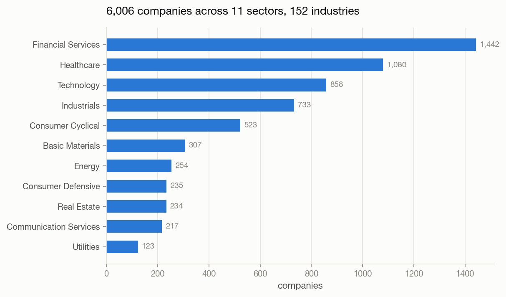
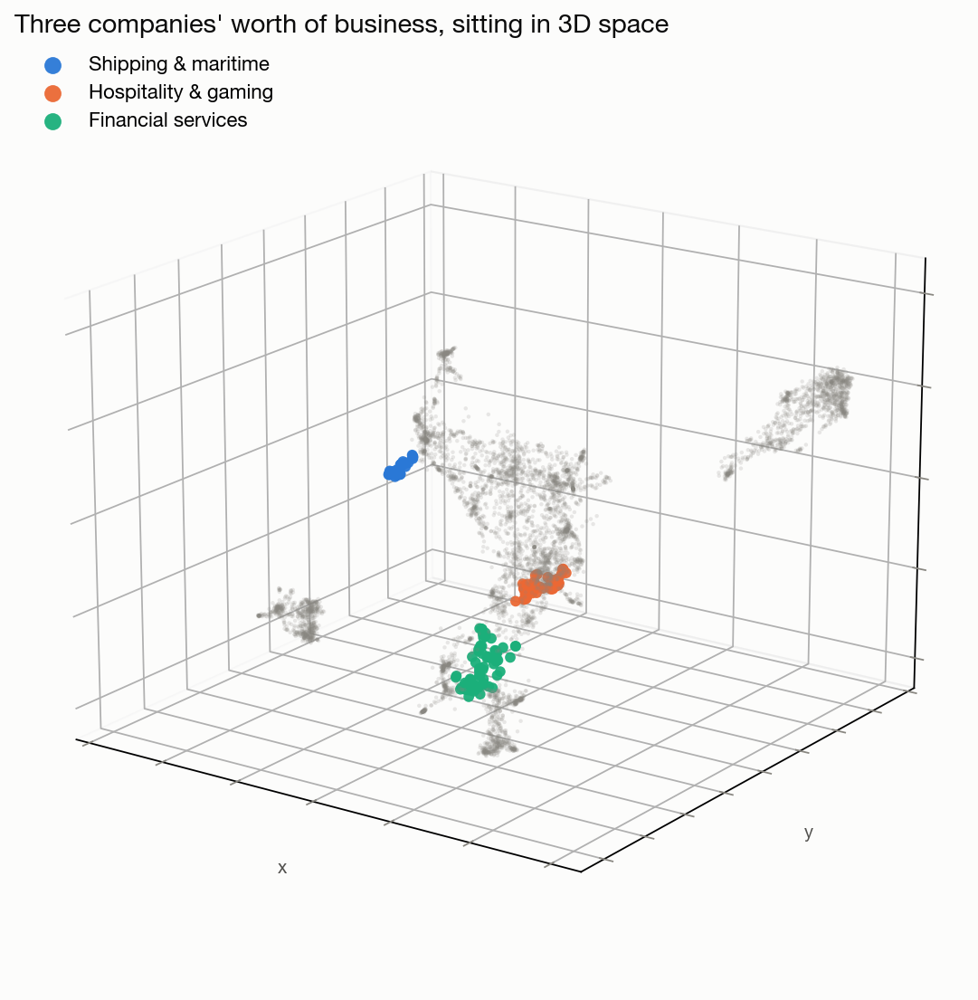
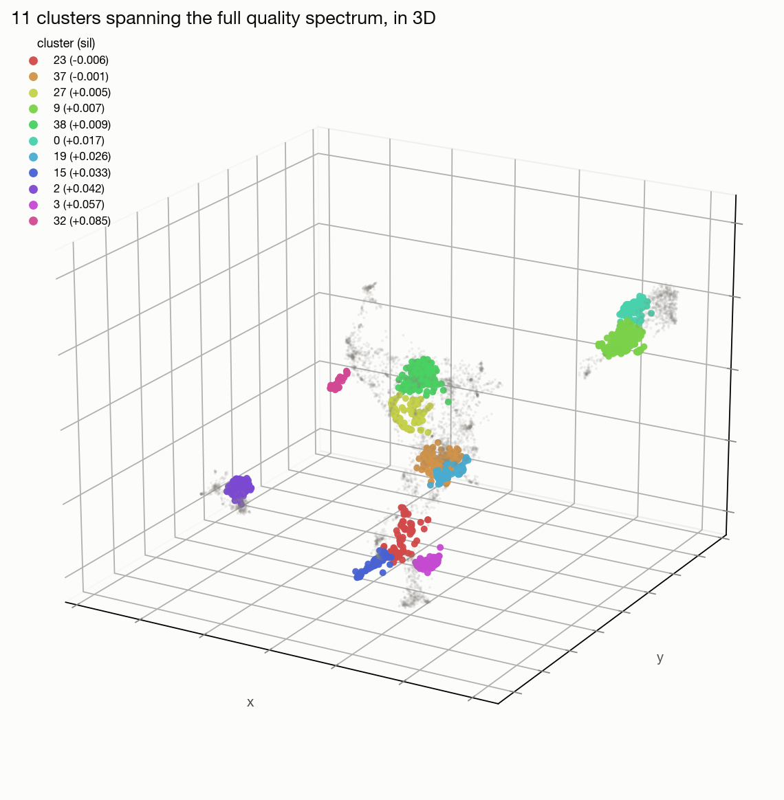

## The Goal

**Question.** Sector and industry are a weak way to group companies around a theme. If you want exposure to something like AI, that idea cuts across a dozen sectors and industries at once — there's no field in a stock screener called "theme." Could we take a company's plain-English description and quantify what it actually says the business does, then use that to search and group companies in a way the standard labels can't?

Beyond search, could we represent a company's semantic characteristics in a format usable as input to a machine learning model? If you wanted to build a model on baskets of stocks that fit some theme, there isn't a great way to do that today outside of sector and industry. And if we can quantify a company's characteristics, we can potentially cluster them too and give them cluster labels — data that would work as an input across different types of ML models.

**Answer.** In large part, yes — and in a simpler way than expected. There's room to improve it, but the core idea works.

---

## Method, at a glance

| | |
|---|---|
| Question | Can company descriptions replace sector/industry as a way to search and group companies by theme? |
| Data | 6,006 US-listed companies (NASDAQ / NYSE / AMEX) — ticker, description, sector, industry |
| Embedding | `BAAI/bge-base-en-v1.5`, 768 dimensions, run locally |
| Compression | UMAP down to 3 dimensions, full-magnitude vector |
| Clustering | K-means on those 3 dimensions, `k=40`, picked by eye off a parameter sweep — not a formal optimum |
| Evaluation | Cosine similarity checks, semantic search, direct read-throughs of cluster membership |
| Scope | No returns data, no backtest. This is a representation-building exercise, not a trading strategy |

---

## The data

6,006 companies, 11 sectors, 152 industries.

Financial Services and Healthcare alone are almost 42% of the dataset. Industry is more granular — 152 buckets — but still dominated by a handful of large ones:

| Industry | Companies |
|---|---:|
| Biotechnology | 630 |
| Shell Companies | 508 |
| Banks - Regional | 324 |
| Software - Application | 271 |
| Asset Management | 161 |
| Software - Infrastructure | 137 |
| Medical - Devices | 120 |
| Semiconductors | 107 |
| Financial - Conglomerates | 104 |
| Aerospace & Defense | 99 |

---

## The problem, concretely

Meta, Alphabet, and Verizon all carry the same sector label:

| Ticker | Company | Sector | Industry |
|---|---|---|---|
| CHTR | Charter Communications, Inc. | Communication Services | Telecommunications Services |
| CMCSA | Comcast Corporation | Communication Services | Telecommunications Services |
| DIS | The Walt Disney Company | Communication Services | Entertainment |
| GOOG | Alphabet Inc. | Communication Services | Internet Content & Information |
| META | Meta Platforms, Inc. | Communication Services | Internet Content & Information |
| NFLX | Netflix, Inc. | Communication Services | Entertainment |
| PINS | Pinterest, Inc. | Communication Services | Internet Content & Information |
| T | AT&T Inc. | Communication Services | Telecommunications Services |
| TMUS | T-Mobile US, Inc. | Communication Services | Telecommunications Services |
| VZ | Verizon Communications Inc. | Communication Services | Telecommunications Services |

Ten companies, one label. Ad-funded social platforms, a search company, cable and wireless carriers, streaming and entertainment — all "Communication Services." To check whether that's actually a meaningful grouping, we embedded each company's description into a 768-dimension vector and measured cosine similarity between six of them:

| A | B | Cosine similarity |
|---|---|---:|
| VZ | T | 0.718 |
| NFLX | DIS | 0.684 |
| T | NFLX | 0.666 |
| T | DIS | 0.660 |
| GOOG | T | 0.640 |
| GOOG | DIS | 0.618 |
| META | T | 0.615 |
| META | GOOG | 0.611 |
| VZ | NFLX | 0.610 |
| GOOG | VZ | 0.610 |
| META | VZ | 0.600 |
| GOOG | NFLX | 0.599 |
| META | NFLX | 0.586 |
| VZ | DIS | 0.585 |
| META | DIS | 0.564 |

Verizon and AT&T — two carriers — are the closest pair, with Netflix and Disney right behind. Both of those are same-sub-industry pairings. The other thirteen combinations all fall into a narrow 0.56–0.67 band with no real separation between them.

That's the useful part. The only strong signal here comes from pairs that already share a sub-industry; the sector label on its own isn't binding anything together.

---

## Semantic search

If the embedding actually captures what a company does, you should be able to search it like a thematic screener instead of a keyword filter. Query: *"companies that produce computer hardware for gaming."*

| Ticker | Company | Sector | Industry | Similarity |
|---|---|---|---|---:|
| CRSR | Corsair Gaming, Inc. | Technology | Computer Hardware | 0.689 |
| NEGG | Newegg Commerce, Inc. | Consumer Cyclical | Specialty Retail | 0.688 |
| NVDA | NVIDIA Corporation | Technology | Semiconductors | 0.661 |
| AMD | Advanced Micro Devices, Inc. | Technology | Semiconductors | 0.654 |
| EA | Electronic Arts Inc. | Technology | Electronic Gaming & Multimedia | 0.634 |
| GME | GameStop Corp. | Consumer Cyclical | Specialty Retail | 0.624 |
| FWDI | Forward Industries, Inc. | Consumer Cyclical | Personal Products & Services | 0.619 |
| LOGI | Logitech International S.A. | Technology | Computer Hardware | 0.619 |

Nothing in that query mentions a sector, and nothing was filtered by one — the results span Technology and Consumer Cyclical on their own. This is the main thing we set out to prove: you can screen by theme, not just by label.

Query: *"uranium mining and nuclear fuel production."*

| Ticker | Company | Sector | Industry | Similarity |
|---|---|---|---|---:|
| UEC | Uranium Energy Corp. | Energy | Uranium | 0.714 |
| UROY | Uranium Royalty Corp. | Energy | Uranium | 0.707 |
| CCJ | Cameco Corporation | Energy | Uranium | 0.695 |
| UUUU | Energy Fuels Inc. | Energy | Uranium | 0.686 |
| FNUC | Frontier Nuclear and Minerals Inc. | Basic Materials | Other Precious Metals | 0.685 |
| URG | Ur-Energy Inc. | Energy | Uranium | 0.675 |
| NUCL | Eagle Nuclear Energy Corp. | Energy | Uranium | 0.654 |
| DNN | Denison Mines Corp. | Energy | Uranium | 0.648 |

Nearly a clean sweep of the Uranium industry. The interesting one is Frontier Nuclear and Minerals at #5 — a nuclear company filed under Basic Materials / Other Precious Metals. An industry screen for "Uranium" would have missed it; the description didn't.

Query: *"regional banks serving farming and agricultural communities."*

| Ticker | Company | Sector | Industry | Similarity |
|---|---|---|---|---:|
| RF | Regions Financial Corporation | Financial Services | Banks - Regional | 0.711 |
| FMNB | Farmers National Banc Corp. | Financial Services | Banks - Regional | 0.710 |
| FMAO | Farmers & Merchants Bancorp, Inc. | Financial Services | Banks - Regional | 0.690 |
| AGM | Federal Agricultural Mortgage | Financial Services | Financial - Credit Services | 0.661 |
| AGM-A | Federal Agricultural Mortgage Corporation | Financial Services | Financial - Credit Services | 0.660 |
| RM | Regional Management Corp. | Financial Services | Financial - Credit Services | 0.638 |
| UCB | United Community Banks, Inc. | Financial Services | Banks - Regional | 0.636 |
| CMTV | Community Bancorp | Financial Services | Banks - Regional | 0.631 |

This one's a mixed bag, and worth being straight about. The genuine hits are the two Farmers banks and Farmer Mac (AGM/AGM-A) — the latter being agricultural lending filed under Credit Services rather than Banks, another cross-industry catch. But Regions Financial and Regional Management look like they're scoring on the words "Regions"/"Regional" more than on anything agricultural. The query mixed two concepts and the weaker one leaked through.

---

## Quantifying a company's characteristics

Search and similarity checks work in the full 768-dimension space, but that's too many numbers to hand to a model or store as a feature. The goal here was specifically to compress each company down to **3 numbers, in a similar magnitude to each other** — small enough to use directly, unlike a 16- or 50-dimension PCA factor set. That looks like this:

| Ticker | Company | x | y | z |
|---|---|---:|---:|---:|
| AERT | Aeries Technology, Inc | -0.83 | 0.02 | 0.72 |
| AES | The AES Corporation | -1.24 | -1.17 | 1.99 |
| AESI | Atlas Energy Solutions Inc. | -1.04 | -1.83 | 2.74 |
| AEVA | Aeva Technologies, Inc. | -0.49 | 0.29 | 0.33 |
| AEYE | AudioEye, Inc. | 0.80 | 0.04 | -0.24 |
| AFBI | Affinity Bancshares, Inc. | 0.90 | -1.42 | -3.90 |
| AFCG | Advanced Flower Capital Inc. | 0.42 | -2.54 | -2.05 |
| AFG | American Financial Group, Inc. | 1.34 | -1.78 | -2.61 |

Three columns, all on a comparable scale, one row per company. How we got there:

We used UMAP to compress the 768-dimension embeddings to 3 dimensions. We tried it two ways: normalizing each company's vector to a pure direction, and keeping the full magnitude. The normalized version came out less useful — clusters were more lopsided, with one or two giant catch-all groups. The full-magnitude version split things up better, so that's the one we kept.

We ran a parameter sweep over UMAP's settings (`n_neighbors`, `min_dist`) and the number of clusters `k` — 36 combinations, scored on five things:

| Metric | What it tells you |
|---|---|
| **Silhouette (3D)** | How cleanly separated the clusters are in the 3D space we're clustering in |
| **Silhouette (768D)** | The same clusters re-scored back in the original 768-dimension space. UMAP is built to make things *look* well-separated, so this is the sanity check on whether the grouping is real |
| **NMI vs industry** | How much the clusters agree with the existing industry labels |
| **NMI vs sector** | Same, against sector |
| **Cluster sizes** | min / median / max — is one cluster swallowing everything? |

No single number picks the winner here. We leaned mostly on the silhouettes plus a sane size distribution, and treated the rest as guardrails — looking for anything badly skewed in one direction rather than optimizing any one column.

On the NMI columns specifically, we weighted **industry over sector**. Industry is far more granular (152 buckets vs 11), so agreement there is more meaningful. Neither should be expected to hit 1.0 — the whole premise is that these labels are inadequate, so perfectly reproducing them would defeat the purpose — but a number way off would be a red flag that the clusters are noise.

What we landed on:

| n_neighbors | min_dist | k | Sil (3D) | Sil (768D) | NMI industry | NMI sector | min | median | max |
|---:|---:|---:|---:|---:|---:|---:|---:|---:|---:|
| 25 | 0.00 | 40 | 0.455 | 0.025 | 0.622 | 0.521 | 73 | 125 | 314 |

Best NMI-industry of any row tested, a competitive silhouette, and the tightest size spread in the sweep — no cluster hoarding the dataset.

> **All 36 rows of the sweep are in the [appendix](#appendix-full-parameter-sweep)** at the end of this document.

---

## What the clusters actually look like

Clustering those 3 numbers with `k=40` gives 40 groups. A few are worth looking at directly.

**Cluster 32 — shipping.** About as clean as it gets. Almost every name here is marine shipping or LNG/oil transport, despite being spread across Industrials and Energy sector labels.

| Ticker | Company | Sector | Industry |
|---|---|---|---|
| ASC | Ardmore Shipping Corporation | Industrials | Marine Shipping |
| BANL | CBL International Limited | Energy | Oil & Gas Midstream |
| CCL | Carnival Corporation & plc | Consumer Cyclical | Travel Services |
| CDLR | Cadeler A/S | Industrials | Marine Shipping |
| CMRE | Costamare Inc. | Industrials | Marine Shipping |
| CTRM | Castor Maritime Inc. | Industrials | Marine Shipping |
| DAC | Danaos Corporation | Industrials | Marine Shipping |
| DHT | DHT Holdings, Inc. | Industrials | Marine Shipping |
| DLNG | Dynagas LNG Partners LP | Industrials | Marine Shipping |
| DSX | Diana Shipping Inc. | Industrials | Marine Shipping |
| ECO | Okeanis Eco Tankers Corp. | Industrials | Marine Shipping |
| EDRY | EuroDry Ltd. | Industrials | Marine Shipping |
| FLNG | FLEX LNG Ltd | Energy | Oil & Gas Midstream |
| FRO | Frontline Plc | Industrials | Marine Shipping |
| GASS | StealthGas Inc. | Industrials | Marine Shipping |
| GLBS | Globus Maritime Limited | Industrials | Marine Shipping |
| GLNG | Golar LNG Limited | Energy | Oil & Gas Midstream |
| GLOP-PA | GasLog Partners LP | Energy | Oil & Gas Midstream |
| GNK | Genco Shipping & Trading Limited | Industrials | Marine Shipping |
| GSL | Global Ship Lease, Inc. | Industrials | Marine Shipping |

**Cluster 19 — hospitality and gaming.** Hotels, casinos, and resorts, spanning Real Estate and Consumer Cyclical.

| Ticker | Company | Sector | Industry |
|---|---|---|---|
| AHT | Ashford Hospitality Trust, Inc. | Real Estate | REIT - Hotel & Motel |
| APLE | Apple Hospitality REIT, Inc. | Real Estate | REIT - Hotel & Motel |
| ATAT | Atour Lifestyle Holdings Limited | Consumer Cyclical | Travel Lodging |
| BALY | Bally's Corporation | Consumer Cyclical | Gambling, Resorts & Casinos |
| BHR | Braemar Hotels & Resorts Inc. | Real Estate | REIT - Hotel & Motel |
| BKNG | Booking Holdings Inc. | Consumer Cyclical | Travel Services |
| BRAG | Bragg Gaming Group Inc. | Technology | Electronic Gaming & Multimedia |
| BYD | Boyd Gaming Corporation | Consumer Cyclical | Gambling, Resorts & Casinos |
| CDRO | Codere Online Luxembourg, S.A. | Consumer Cyclical | Gambling, Resorts & Casinos |
| CHDN | Churchill Downs Incorporated | Consumer Cyclical | Gambling, Resorts & Casinos |
| CHH | Choice Hotels International, Inc. | Consumer Cyclical | Travel Lodging |
| CNNE | Cannae Holdings, Inc. | Consumer Cyclical | Restaurants |
| CNTY | Century Casinos, Inc. | Consumer Cyclical | Gambling, Resorts & Casinos |
| CVEO | Civeo Corporation | Industrials | Specialty Business Services |
| CZR | Caesars Entertainment, Inc. | Consumer Cyclical | Gambling, Resorts & Casinos |
| DKNG | DraftKings Inc. | Consumer Cyclical | Gambling, Resorts & Casinos |
| DRH | DiamondRock Hospitality Company | Real Estate | REIT - Hotel & Motel |
| FLL | Full House Resorts, Inc. | Consumer Cyclical | Gambling, Resorts & Casinos |
| FLUT | Flutter Entertainment plc | Consumer Cyclical | Gambling, Resorts & Casinos |
| FUN | Six Flags Entertainment Corporation | Consumer Cyclical | Leisure |

**Cluster 23 — financial infrastructure.** This one scored as our *worst* cluster on the numbers, but it's actually one of the more interesting groupings in the whole set. Financial Services, Technology, Real Estate, and Industrials labels all mixed together — but every one of these is some flavor of financial-services infrastructure: exchanges, data providers, capital markets, consulting.

| Ticker | Company | Sector | Industry |
|---|---|---|---|
| AIRE | reAlpha Tech Corp. | Technology | Software - Application |
| AON | Aon plc | Financial Services | Insurance - Brokers |
| BAH | Booz Allen Hamilton Holding Corporation | Industrials | Consulting Services |
| BGC | BGC Group, Inc | Financial Services | Financial - Capital Markets |
| BR | Broadridge Financial Solutions, Inc. | Technology | Information Technology Services |
| BV | BrightView Holdings, Inc. | Industrials | Specialty Business Services |
| CME | CME Group Inc. | Financial Services | Financial - Data & Stock Exchanges |
| COHN | Cohen & Company Inc. | Financial Services | Financial - Capital Markets |
| CRAI | CRA International, Inc. | Industrials | Consulting Services |
| CSGP | CoStar Group, Inc. | Real Estate | Real Estate - Services |
| CXW | CoreCivic, Inc. | Real Estate | REIT - Specialty |
| DFIN | Donnelley Financial Solutions, Inc. | Technology | Software - Application |
| DOMH | Dominari Holdings Inc. | Financial Services | Financial - Capital Markets |
| EVR | Evercore Inc. | Financial Services | Financial - Capital Markets |
| FCN | FTI Consulting, Inc. | Industrials | Consulting Services |
| FDS | FactSet Research Systems Inc. | Financial Services | Financial - Data & Stock Exchanges |
| FTHM | Fathom Holdings Inc. | Real Estate | Real Estate - Services |
| GEO | The GEO Group, Inc. | Industrials | Security & Protection Services |
| HCKT | The Hackett Group, Inc. | Technology | Information Technology Services |
| HLI | Houlihan Lokey, Inc. | Financial Services | Investment - Banking & Investment Services |

That's the pattern worth taking away: even the cluster that scored worst on paper still found a real, human-readable theme that the sector/industry labels completely miss.

---

## Seeing it in 3D

Same three clusters, plotted in the actual 3D space they live in:

Shipping, hospitality, and financial infrastructure — three completely different businesses — sit as three tight, clearly separated groups. This is the whole idea in one picture.

Zooming out to more clusters at once, spanning the full range from our best-scoring group down to our worst:

Same story at a larger scale — each of these holds together as its own tight group, distinct from the others and from the general cloud of everything else.

---

## Conclusion

We set out to build something like a bootstrapped thematic search engine for companies — a way to go beyond keyword and sector/industry screening. That part works well. Each of the three search examples pulled a coherent set of companies around a theme, spanning whatever sectors and industries happened to hold them — including a nuclear company filed under Basic Materials / Other Precious Metals that an industry screen would have missed outright.

The clusters do the same job from the other direction. Shipping came together across Industrials and Energy, hospitality across Real Estate and Consumer Cyclical, and financial infrastructure across four different sectors — none of it specified in advance.

We also set out to characterize a company's description as a small set of numbers. PCA is a legitimate way to do that too, but it tends to want more dimensions to hold onto useful signal. The specific goal here was to keep it to **three numbers, all in a similar magnitude** — small enough to use directly as model inputs, which a 16- or 50-dimension PCA factor set isn't.

From here there are a couple of directions worth exploring, neither of which we've built yet:

- **Categorical labels** — feed the cluster ID into a model as a category.
- **Raw components** — feed the x/y/z numbers in directly and let the model find its own structure across them, rather than committing to one fixed partition.

The reason this is worth doing at all: stocks inside the same ETF, sector, or industry often trade completely differently from each other. A grouping based on what a company actually does, instead of what label it was assigned, might be a better way to build that structure than the categories the market already uses.

---

## Code Repository

[View on GitHub →](https://github.com/tenicho/semantic-equity-classification)

---

## Appendix: full parameter sweep

All 36 combinations, full-magnitude vector. Selected row in **bold**.

| n_neighbors | min_dist | k | Sil (3D) | Sil (768D) | NMI industry | NMI sector | min | median | max |
|---:|---:|---:|---:|---:|---:|---:|---:|---:|---:|
| 10 | 0.00 | 20 | 0.494 | 0.034 | 0.589 | 0.532 | 102 | 294 | 652 |
| 10 | 0.00 | 30 | 0.445 | 0.024 | 0.605 | 0.516 | 69 | 182 | 392 |
| 10 | 0.00 | 40 | 0.453 | 0.024 | 0.618 | 0.516 | 37 | 127 | 392 |
| 10 | 0.10 | 20 | 0.410 | 0.028 | 0.584 | 0.528 | 135 | 300 | 650 |
| 10 | 0.10 | 30 | 0.415 | 0.027 | 0.612 | 0.530 | 80 | 177 | 619 |
| 10 | 0.10 | 40 | 0.407 | 0.020 | 0.612 | 0.506 | 48 | 136 | 363 |
| 10 | 0.25 | 20 | 0.371 | 0.028 | 0.579 | 0.531 | 82 | 312 | 645 |
| 10 | 0.25 | 30 | 0.379 | 0.027 | 0.606 | 0.523 | 82 | 178 | 596 |
| 10 | 0.25 | 40 | 0.363 | 0.019 | 0.607 | 0.507 | 81 | 139 | 265 |
| 25 | 0.00 | 20 | 0.479 | 0.035 | 0.599 | 0.550 | 165 | 270 | 646 |
| 25 | 0.00 | 30 | 0.449 | 0.026 | 0.614 | 0.535 | 80 | 177 | 403 |
| **25** | **0.00** | **40** | **0.455** | **0.025** | **0.622** | **0.521** | **73** | **125** | **314** |
| 25 | 0.10 | 20 | 0.458 | 0.034 | 0.600 | 0.556 | 137 | 286 | 646 |
| 25 | 0.10 | 30 | 0.406 | 0.025 | 0.607 | 0.528 | 80 | 194 | 338 |
| 25 | 0.10 | 40 | 0.415 | 0.024 | 0.620 | 0.522 | 58 | 140 | 331 |
| 25 | 0.25 | 20 | 0.411 | 0.032 | 0.590 | 0.544 | 141 | 301 | 646 |
| 25 | 0.25 | 30 | 0.370 | 0.024 | 0.610 | 0.533 | 79 | 179 | 393 |
| 25 | 0.25 | 40 | 0.382 | 0.024 | 0.617 | 0.516 | 79 | 139 | 296 |
| 50 | 0.00 | 20 | 0.427 | 0.029 | 0.592 | 0.546 | 169 | 272 | 623 |
| 50 | 0.00 | 30 | 0.453 | 0.030 | 0.613 | 0.536 | 81 | 186 | 597 |
| 50 | 0.00 | 40 | 0.452 | 0.025 | 0.619 | 0.520 | 62 | 135 | 346 |
| 50 | 0.10 | 20 | 0.412 | 0.031 | 0.594 | 0.543 | 146 | 298 | 639 |
| 50 | 0.10 | 30 | 0.413 | 0.028 | 0.603 | 0.523 | 83 | 205 | 346 |
| 50 | 0.10 | 40 | 0.418 | 0.026 | 0.620 | 0.523 | 73 | 137 | 329 |
| 50 | 0.25 | 20 | 0.365 | 0.026 | 0.581 | 0.538 | 155 | 306 | 407 |
| 50 | 0.25 | 30 | 0.374 | 0.026 | 0.602 | 0.527 | 83 | 184 | 323 |
| 50 | 0.25 | 40 | 0.372 | 0.025 | 0.614 | 0.520 | 51 | 142 | 287 |
| 100 | 0.00 | 20 | 0.484 | 0.037 | 0.603 | 0.558 | 150 | 278 | 644 |
| 100 | 0.00 | 30 | 0.432 | 0.028 | 0.610 | 0.535 | 82 | 189 | 399 |
| 100 | 0.00 | 40 | 0.450 | 0.025 | 0.618 | 0.522 | 65 | 132 | 339 |
| 100 | 0.10 | 20 | 0.411 | 0.032 | 0.588 | 0.538 | 159 | 289 | 638 |
| 100 | 0.10 | 30 | 0.405 | 0.026 | 0.605 | 0.527 | 70 | 177 | 368 |
| 100 | 0.10 | 40 | 0.410 | 0.025 | 0.614 | 0.519 | 70 | 133 | 333 |
| 100 | 0.25 | 20 | 0.373 | 0.031 | 0.590 | 0.545 | 170 | 297 | 634 |
| 100 | 0.25 | 30 | 0.366 | 0.026 | 0.595 | 0.521 | 100 | 188 | 338 |
| 100 | 0.25 | 40 | 0.373 | 0.024 | 0.613 | 0.517 | 52 | 141 | 304 |

Two patterns stand out. `k=20` consistently produces a lopsided distribution — max cluster sizes in the 620–650 range across nearly every setting — while `k=40` tightens that considerably. And NMI-industry climbs steadily with `k`, which makes sense: more clusters can express more of the 152 industries.
