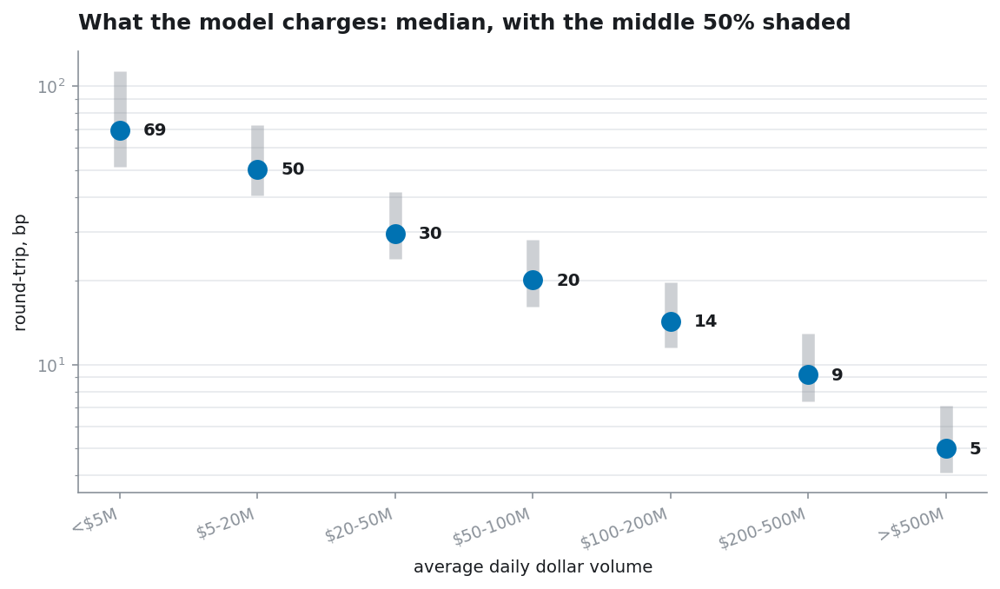
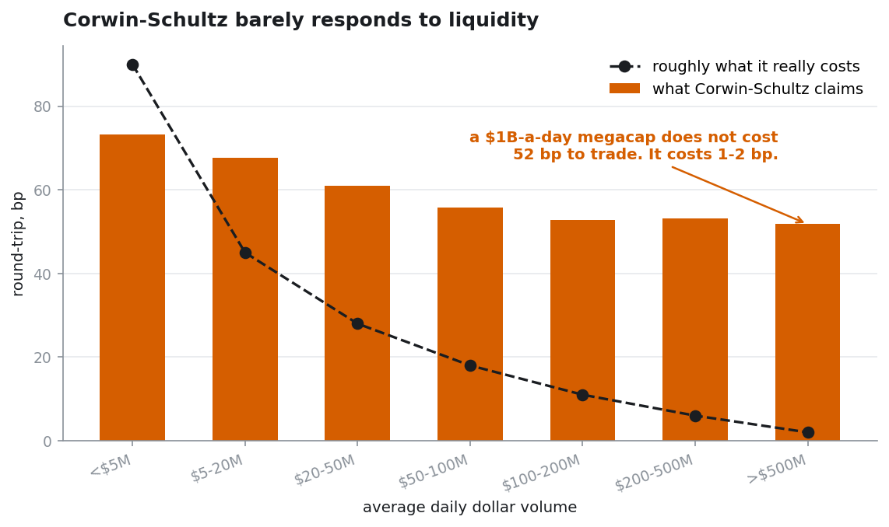
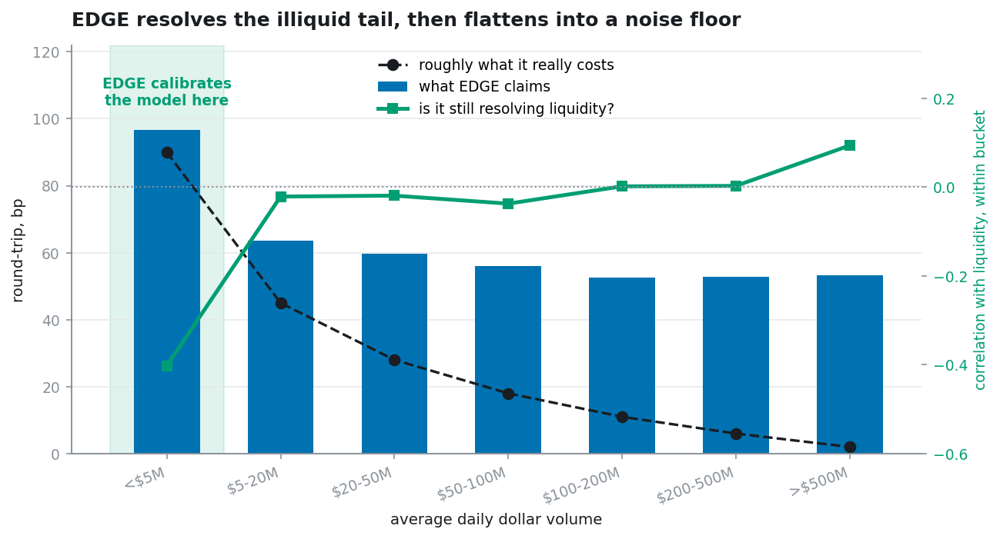
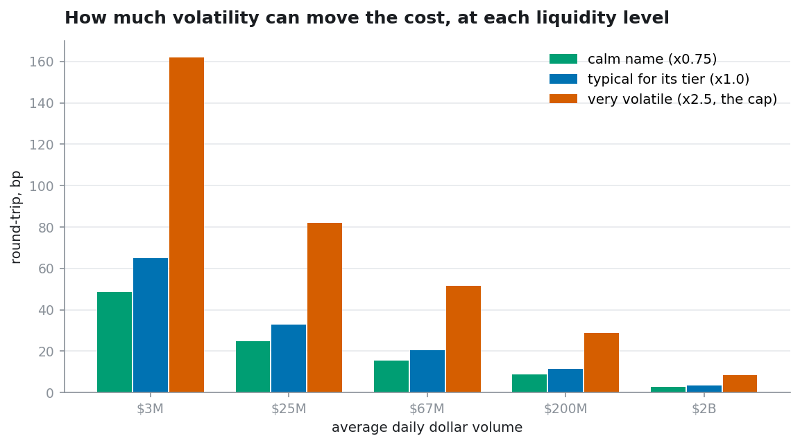
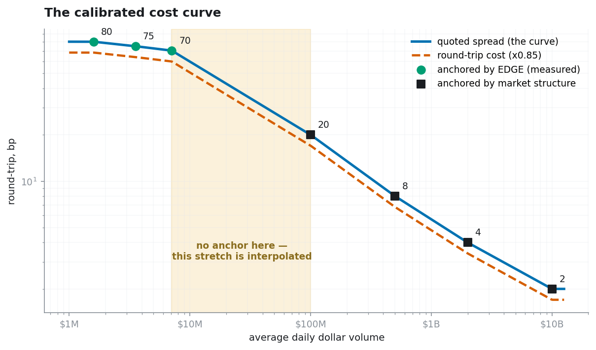

A plain-language walkthrough of how spread estimators work, why they break, and where the
boundaries in `cost_model.py` come from. `README.md` is the method; this is the reasoning behind it.

---

## 1 · What we are trying to estimate

At any moment a stock has two prices:

- the **bid** — what buyers are currently offering
- the **ask** — what sellers are currently asking

You buy at the ask and later sell at the bid, so you lose the gap between them. That gap is the
**spread**, and it is the main cost of trading.

| | spread | as % of price |
|---|---|---|
| Apple at $135 | ~1 cent | **0.007%** |
| a $4 microcap | ~4 cents | **1.0%** |

Roughly 150× different. So cost depends almost entirely on how heavily traded a stock is.



**The problem: our data has no bid or ask.** Only open, high, low, close and volume per day. The
spread has to be inferred from those, or sidestepped.

---

## 2 · The fingerprint every estimator hunts for: bid-ask bounce

Imagine a stock whose true value is **$10.00 and never moves all week**. Bid $9.90, ask $10.10.

The closing price each day is simply whatever the *last trade* happened to be:

| day | last trade was a… | recorded close |
|---|---|---|
| Mon | buy | $10.10 |
| Tue | sell | $9.90 |
| Wed | buy | $10.10 |
| Thu | sell | $9.90 |

Recorded returns: −2%, +2%, −2%. **The stock never moved, but the tape zig-zags.**

That zig-zag is caused purely by the spread, and its size reveals the spread's size. Every
estimator — Roll, Corwin–Schultz, EDGE — is trying to measure that zig-zag and separate it from
the stock's genuine movement.

---

## 3 · Corwin–Schultz

**Inputs: high and low only.** Over one day, and over two consecutive days.

```
β = [ln(H₁/L₁)]² + [ln(H₂/L₂)]²      two separate single-day ranges
γ = [ln(H₁₂/L₁₂)]²                    ONE range spanning both days

S = 2(e^α − 1)/(1 + e^α)              α built from β and γ
```

**The idea: volatility grows with time, a spread does not.** Over two days true price variance
doubles, but the spread is baked into any range you measure exactly once, however long it is.
Compare "two one-day ranges" against "one two-day range" and the volatility part scales
predictably while the spread part does not — the difference should isolate the spread.

**Why it fails.** Everything is a range. When the stock actually moved, β and γ are both dominated
by real movement and the spread is a tiny residual between two large numbers. It also assumes
volatility is constant across the two days; when it isn't, the residual goes the wrong way, which
is why CS routinely returns **negative** spreads that get clipped to zero.

**Measured on our panel:**

| | |
|---|---|
| correlation with liquidity | **−0.002** |
| correlation with volatility | **+0.580** |
| claimed cost, >$500M ADV megacap | **52 bp** (reality: 1–2 bp) |

Once volatility is partialled out, CS separates the entire ADV spectrum by **18 bp**. It is a
volatility estimator wearing a spread estimator's name. **Not used anywhere in this model.**



---

## 4 · EDGE

**Inputs: all four prices — and critically, across consecutive days.**

```
m = (h + l)/2                    mid-range, a stand-in for the "true" price

S² ≈ −4·E[(oₜ − mₜ)(oₜ − mₜ₋₁)]  −  4·E[(cₜ − mₜ)(cₜ − mₜ₊₁)]
                          ↑                            ↑
                     yesterday                    tomorrow
```

**The idea.** The open and close are each *one specific trade*, so each prints at either the bid or
the ask. With no spread they'd scatter randomly around the true price; with a spread they sit
systematically ±S/2 away from it.

**Why multiplying across days is the whole trick.** The true price movement from yesterday to today
is random noise. Multiply two terms containing independent noise, average over many days, and
**the noise cancels to zero**. The spread appears in both terms with a consistent relationship, so
it **survives the averaging**.

> Averaging destroys the volatility and preserves the spread.

This is why a within-day-only formula cannot work: inside a single bar there is nothing to average
against. (A proposed formula using only same-day terms tested *worse* than CS — correlation with
volatility +0.677, with liquidity −0.028.)

EDGE is a real improvement: correlation with liquidity **−0.420** against CS's −0.002.



---

## 5 · How much data you need — the (σ/S)⁴ rule

Averaging only works if you average enough. Here is how much.

The signal is size **S²**. The noise being averaged away is size **σ²**. Averaging N days shrinks
noise by √N. So the spread becomes visible when:

```
S² > σ²/√N        →        N > (σ/S)⁴
```

**A fourth power.** Double the volatility-to-spread ratio and you need **16×** the data.

| | spread S | daily vol σ | σ/S | days needed |
|---|---|---|---|---|
| microcap | 100 bp | 200 bp | 2 | **16** |
| $25M ADV | 25 bp | 190 bp | 7.6 | **3,300** |
| megacap | 1.5 bp | 180 bp | 120 | **207,000,000** |

**This is the entire reason for the $10M ADV cutoff.** Nothing about EDGE changes across that line.
What changes is whether you have enough data to average the volatility away.

### Verified by simulation

Generate fake prices containing a spread we *chose*, hand EDGE only the four bar prices, see if it
finds the answer. The rule predicted every row:

| true spread | σ/S | days needed | given 3,000 days | EDGE said | error |
|---|---|---|---|---|---|
| 300 bp | 1 | 1 | ✓ | 303 bp | +1% |
| 100 bp | 3 | 81 | ✓ | 101 bp | +1% |
| 50 bp | 5 | 625 | ✓ | 54 bp | +8% |
| 20 bp | 10 | 10,000 | ✗ | 16 bp | −21% |
| 10 bp | 18 | 105,000 | ✗ | 1 bp | −94% |
| 1 bp | 180 | 1 billion | ✗ | **13 bp** | **+1160%** |

Same estimator, same code. Only the required sample size changed — by a factor of a billion.

### The consequence that matters most for us

Hold the true spread **fixed at 100 bp** and raise only volatility:

| daily vol | σ/S | EDGE said | error |
|---|---|---|---|
| 1.0% | 1.0 | 103 bp | +3% |
| 4.0% | 0.25 | 105 bp | +5% |
| 8.0% | 0.12 | **126 bp** | **+26%** |
| 15.0% | 0.07 | **141 bp** | **+41%** |

**The spread never changed. Only volatility did — and the estimate inflated 41%.**

A strategy that selects volatile names will be systematically overcharged by any bar-geometry
estimator. Not because those stocks cost more, but because the estimator cannot separate the two.
That is the single strongest argument for anchoring cost to **liquidity** and letting volatility
only scale it within bounds.



---

## 6 · Does pooling rescue it? Partly.

Our anchors are not single 21-day readings — each is the **median of ~2 million** overlapping
windows across thousands of stocks. Pooling that many should crush the noise.

**It does, down to a point.** Same simulation, but running the model's actual procedure — 21-day
windows, pooled, median:

| true spread | σ/S | pooled median | error |
|---|---|---|---|
| 300 bp | 1.0 | 295 bp | −2% ✓ |
| 150 bp | 1.7 | 146 bp | −3% ✓ |
| 100 bp | 2.0 | 97 bp | −3% ✓ |
| 50 bp | 4.0 | 53 bp | +7% ✓ |
| 25 bp | 7.6 | **41 bp** | **+62%** ✗ |
| 10 bp | 18.0 | **36 bp** | **+258%** ✗ |

**Pooling fixes noise. It does not fix bias.** Below roughly a 50 bp true spread the error stops
being random scatter and becomes a systematic floor — notice the last two rows both land near
36–41 bp whether the truth was 25 or 10. Averaging millions of readings then gives a very precise
measurement of that floor.

### What this says about our own anchors

Ours are **80.4 / 75.1 / 70.4 bp**. They sit above the ~40 bp floor, so they are not pure noise.
But the bias runs upward and grows as true spreads fall — which is very likely why they are so
**flat** across a 4.4× range of ADV.

If the true spreads are something like 100 / 70 / 45 bp, the estimator would compress them upward
toward its floor and report roughly 80 / 75 / 70. That is exactly the pattern we see.

**So the $7.08M anchor is probably too expensive**, and because the interpolated middle starts
there, costs across $7M–$100M are likely overstated too. That is the conservative direction —
overcharging rather than under — but it is still wrong.

---

## 7 · Why a longer window doesn't fix it

The fourth power cuts both ways:

| window | smallest spread it can resolve (σ ≈ 200 bp) |
|---|---|
| 21 days | ~93 bp |
| 60 days | ~76 bp |
| 252 days (1 year) | ~53 bp |

Quadrupling the window buys about 20 bp of resolution.

**Which means the $10M–$100M gap cannot be filled with EDGE at any window length.** True spreads
there are 20–50 bp — below what daily OHLC can resolve, full stop. That gap is not a calibration
choice; it is a hard limit of the data.

Closing it needs different data: broker TCA reports, or published effective-spread statistics by
liquidity bucket.

---

## 8 · So why the model looks the way it does



| decision | reason |
|---|---|
| **No estimator used as the cost directly** | Bar geometry cannot separate spread from movement where the spread is small — and our strategies select volatile names, the worst case |
| **Corwin–Schultz not used at all** | Zero correlation with liquidity (−0.002). It measures volatility |
| **EDGE used only below $10M ADV** | Above that, `(σ/S)⁴` exceeds any window we can run |
| **EDGE used only in aggregate** | A single 21-day reading is far too noisy; the anchor is a median of ~2M |
| **Fixed anchors above $100M** | Observable market structure. No OHLC estimator can resolve 1 bp from daily bars |
| **Volatility as a bounded multiplier (0.75–2.5×)** | Volatile names really do trade wider, so the effect is real — but bounding it stops volatility taking over the estimate, which is precisely how CS fails |
| **Log-linear interpolation between anchors** | Smooth and monotone, no tier cliffs. Honest about the fact that the middle is interpolated |

## The two things to stay suspicious of

1. **The $7M–$100M stretch is interpolated**, and roughly two-thirds of trades at ADV ≥ $25M land
   in it. It cannot be improved with this data.
2. **The illiquid anchors are probably biased upward**, compressed toward the estimator's floor.
   Conservative, but wrong — and the reason they look implausibly flat.
