# Cross-Sectional Forward-Return Ranking on US Equities

I wanted to know whether ordinary daily price data still carries enough signal to build a swing
trading strategy I could actually run myself, without watching a screen during market hours.

This is what came out of it: a random forest that ranks the liquid US equity universe by predicted
40-day forward return, and a portfolio that buys the top 1% of that ranking.

| | |
|---|---|
| Strategy | Random forest ranks the liquid US universe by predicted 40-day forward return; trade the top 1% |
| Data | Sharadar US equity daily panel, 1998-01-02 to 2026-07-31 |
| Development | 2006-03-17 .. 2022-12-30 — walk-forward, 6 folds, 63-session embargo |
| Holdout | 2023-01-03 .. 2026-07-30 (3.6 years) |
| Execution | Monthly entry, ~2-month hold, orders placed at the open, exits at the close |
| Costs | Calibrated spread + impact curve, full round trip charged on entry |
| Benchmarks | SPY, VTI, and an equal-weight S&P 500 built with the same execution machinery |
| Grading | Sharpe / Sortino excess of a flat 3.75% hurdle |

**What I think is genuinely interesting here.** Using nothing but daily open, high, low, close and
volume — the data every investor already has, free — the model finds enough signal to pick stocks
with strong trend and momentum that go on to outperform. And it does it inside an execution scheme
any trader could actually run: orders written after the close, filled at the next open, one trading
day a month. No high-frequency data, no exotic feeds, no infrastructure. The results are not
monumental and this is not a strategy that scales to serious size as it stands, but as a
demonstration that ordinary price data still carries usable cross-sectional signal, I think it holds
up. It is also a floor rather than a ceiling: OHLCV is a commodity, so unique signal is hard to
build from it alone, and the natural next step is to add data that isn't — valuations, fundamentals,
sentiment. Getting this far on the free stuff is what makes that worth doing.

**In one paragraph.** The model ranks stocks correctly, and the ranking survived out of sample. The
portfolio built on that ranking has not clearly beaten the index on a risk-adjusted basis: it
returned +15.7%/yr against SPY's +8.8% in development and +37.4% against +22.6% in the holdout, but
out of sample its excess Sharpe of 1.17 sits between SPY's 1.18 and a momentum ETF's 1.12 — a
three-way tie. It comfortably beats a naive momentum sort, which is the evidence that the model
itself is doing work. The goal of building something genuinely tradable from ordinary data was met.
The open problem is drawdown severity. Taking the model as it stands, the most promising unexplored
lever is regime-dependent sizing; for improving the model itself, it is better data.

---

## What I was trying to build

The goal was a model I could actually trade myself — by hand or automated — without sitting in front
of a screen during market hours. That constraint drove everything else.

**The execution cycle had to be relaxing.** High-frequency execution is expensive, operationally
demanding, and unforgiving of slippage. I wanted a cycle where every decision is made while the
market is closed and every order is a plain market order:

1. **After the close** — run the model on the day's completed bars, generate the order list.
2. **Next morning at the open** — the orders execute.
3. **At the close on rebalance days** — exiting positions are sold.

Nothing is decided intraday, and nothing depends on reacting to a live quote. The backtest is wired
the same way: entry is the **open of t+1**, exit is the **close of t+H**.

**The long horizon is also a cost argument.** One of the biggest problems for day traders and
high-frequency strategies is round-trip cost. Every trade pays the spread, and at short horizons you
pay it over and over. If I built something on a minutes, hours, or even daily horizon, then even
assuming I found real signal, getting it to come out net positive after costs is a hard problem on
its own. Stretching the horizon out and cutting turnover puts me in a more competitive spot: I trade
one day a month, so I'm paying that cost a handful of times a year instead of constantly.

The longer horizon also filters out day-to-day noise. If a stock has real trend and momentum behind
it but gets knocked around by some short-term macro headline, that volatility isn't necessarily
telling me anything about where the stock is headed over the next couple of months. I wanted a model
that could look past it.

**It had to run on data anyone can get.** The features are built almost entirely from daily OHLC and
volume, plus VIX and two S&P-derived series. No fundamentals, no analyst data, no alternative data,
no order-book microstructure. I wanted to see whether ordinary price data still carries a tradable
cross-sectional signal.

**The premise is ranking, not forecasting.** Rather than specify a rule — buy high momentum, buy
cheap — the model gets ~36 features per stock per day and learns the ordering. What it outputs is
not a return forecast in dollars but a **rank**: on any given day, which names are likelier to
outperform over the next stretch. Two consequences follow:

- **Everything is measured cross-sectionally, per date.** Features are percentile ranks within the
  day, the label is the forward return z-scored within the day, and every gate is computed per date
  and then averaged. The model is never asked to time the market, only to sort it.
- **The signal trains on gross returns, and costs get applied afterward.** I wanted the model
  learning from the actual returns it would have captured, with cost handled after the fact. Take a
  small-cap that goes sideways but is volatile: costs could easily push that trade's net return
  negative. That loss is real and it belongs in the results. But if I bake it into the label, I'm
  teaching the model something subtly wrong, because it starts learning to avoid volatile names for
  being expensive rather than for being bad picks. So cost stays out of what the model learns from,
  and goes into everything I measure afterward.

---

## How it trades

`monthly_tranche2`, stated precisely, because the mechanics matter for reading the risk numbers:

- Once a month, on the first eligible session, I take the top 1% of that day's ranking and buy up to
  **15 names**, equal weight. That group is one **batch**.
- Each batch is held for two rebalance periods, which works out to about **42 sessions, or roughly
  two calendar months.**
- So once the book is fully established, there are always at least **two batches running at the same
  time**. Every rebalance I close out the older batch and start a new one, which means I'm trading
  one day a month and turning over about half the book each time.

Target book size is 30 names (two batches of 15). In practice the book **holds about 20**, because
the top 1% of a ~1,070-name daily universe supplies only **11.2 candidates per session**, fewer than
the 15 a batch asks for. That comes from pairing a tight threshold with a once-a-month entry, and it
matters for one reason: equal-weighted idiosyncratic risk scales as 1/N, so the book carries
meaningfully more diversifiable risk than a 30-name book would. It is the single largest driver of
the drawdown and ruin numbers later on.

### A note on the 80/20 hedge

The decile ladder further down shows something I didn't set out to build: the bottom of the ranking
carries signal too. Those names tend to actually underperform, not just fail to outperform. Looking
at it now that makes sense. The whole premise is that a higher threshold means a higher expected
return, and if that slope holds going up, there's no real reason it should stop at the bottom. The
least-confident names should sit at the other end of the same line.

So out of curiosity I built an 80/20 version: hold the long book at 80% weight and short the bottom
1% at 20%, on the same monthly schedule.

**This is here to illustrate an idea, not as a strategy I'm pitching.** I wouldn't actively trade it
as it stands. It complicates the strategy, my short-side cost estimates are rudimentary, and
shorting brings real-world problems (borrow, locate, recall, Rule 201) that I'm modelling loosely at
best. The full list of assumptions is in
[The hedge, and what it assumes](#the-hedge-and-what-it-assumes).

What I think it does show is a direction worth exploring. Because the threshold-to-return slope is
positive, there's a plausible path to using this model, or more likely a separate model built
specifically for the short side, to help protect against downside risk. If I actually implemented
something like this, I'd build a dedicated shorting model and layer it on top of the long book
rather than mirroring the long ranking and assuming it works in reverse. The same thinking applies
to dialing back long exposure in bad regimes, which is really the other half of the same idea.

---

## Data

Sharadar US equity daily panel: **41.8M raw rows** across **19,024 tickers**, 1998-01-02 to
2026-07-31.

**There is no survivorship bias.** The panel carries every ticker that ever listed, not only those
alive today — **70% of the 19,024 tickers are flagged delisted**, and their bars are real: the last
bar *is* the delisting. A model tested only on companies that survived would be reading a rigged
tape, because the failures are exactly the names a momentum ranker can get badly wrong. Delisting
records were cross-checked against SEC EDGAR Form 25 filings in the data pipeline that builds this
panel .

The enriched feature panel is **23.6M rows × 51 columns**. (Feature computation is restricted to
tickers that ever reached \$10M average dollar volume, purely because enriching all 41.8M rows won't
fit in memory. It can't drop a tradeable row, since any bar clearing the \$25M trading floor belongs
to a ticker that cleared \$10M at some point.)

Two properties of this vendor's data shaped the implementation, and both were bugs in an earlier
version of this work:

| | |
|---|---|
| `close` is fully adjusted | Safe for ratios (returns, momentum, moving averages), unsafe as a cross-sectional level. Sharadar ships `close_raw` — the price the tape actually printed — so price levels and the cost model's tick floor use that. |
| `volume` is split-adjusted | Its *level* carries information from the future. See below — no volume level appears anywhere in the feature set. |

### Why raw volume never appears as a feature

Split-adjusted volume restates historical share counts into today's units. If a stock did a 2-for-1
split, every volume figure before it gets **multiplied by 2**. A bar that printed 1,000 shares ten
years ago now reads 10,000.

That makes the *level* leak, because companies split after their price has run up. An inflated
historical volume is a fingerprint of splits that happened later, which makes it a fingerprint of
the stock having gone up later. Sorting stocks by their stored volume, the top decile is **three
times more likely to split over the following five years** than the bottom decile (22.9% vs 7.6%).
Some of that is real — big liquid companies do split more — but comparing against split-invariant
`dollar_volume` puts roughly **+0.11 of rank correlation with forward returns** beyond what the clean
column explains. That excess is contamination, and it is about **twice the size of the model's actual
+0.049 edge**, which is exactly the kind of thing a tree model finds and leans on.

So no volume level is used anywhere. Every volume feature is **scale-invariant** — multiply every
volume by any constant and the value doesn't move. `vol_ratio` (volume over its own trailing
average), `vol_z` (a z-score), `updn_vol` and `cmf20` all pass, because the adjustment factor sits in
both the numerator and the denominator and cancels. `dollar_volume` and `med_dv` are used directly,
since raw price × raw shares was never adjusted to begin with — which also means the \$25M ADV floor
is untouched by any of this.

The general rule this enforces: **if a column has been retroactively restated, only use forms of it
that cancel the restatement.**

**Universe.** ADV ≥ \$25M, price ≥ \$5, at least 252 bars of history. That yields **6,833,732 eligible
stock-days**, averaging **985 names per day** across 6,936 sessions. The 252-bar requirement is why
tradeable history starts 1999-01-04 — the first year is consumed as warm-up for trailing windows.

**What the model actually gets:** daily open, high, low, close (both adjusted and as-printed),
volume, dollar volume, and sector, across every listed and delisted US name — plus VIX and two
S&P-derived series for market context. That's it. No fundamentals, no shares outstanding, no
bid/ask, no risk-free series. The liquidity floor is therefore a liquidity screen and not a size
screen, since market cap can't be computed without share counts.

---

## The features, and how I picked them

I went down a rabbit hole early on trying different methods to evaluate features. At some point I
stepped back and asked a simpler question: what *kinds* of things actually move trend and momentum?
Rather than chase individual indicators, I broke it into classes and worked from there.

Everything here ultimately relates to trend. Direction is one class. Mean reversion is another,
because a stock stretched away from its own average behaves differently than one that isn't.
Momentum is its own thing. Volume and liquidity are about flow — who is actually moving the stock.
And volatility and market state give the model some context about the environment it's operating in.
This model isn't built to trade regime, but I wanted it to at least know something about it.

| class | what it's getting at | examples |
|---|---|---|
| Trend / direction | where the stock sits relative to its own path | distance from 20/50/200-day SMA, ADX, MACD distance, linear-regression slope, Ichimoku cloud distance |
| Mean reversion | how stretched it is | RSI, stochastic, CMO, MFI, Aroon oscillator |
| Momentum | persistence of the move | 20-day return, 12-1 and 6-1 momentum, % of 52-week high, momentum consistency |
| Volume / flow | who is behind the move | volume ratio, volume z-score, up/down volume, Chaikin money flow, signed dollar flow |
| Liquidity | tradability, and the real price level | median dollar volume, dollar volume, raw close |
| Volatility / market state | the environment | VIX, S&P realised vol, S&P distance from its 200-day |

From each class I picked a handful of features, which lands at **36 total**: 33 per-date
cross-sectional percentile ranks, plus 3 market-wide series (VIX, S&P distance from its 200-day, S&P
5-day realised vol). Those last three stay raw and winsorised rather than ranked, because a value
that is identical for every stock on a given date would rank to 0.5 across the board and the feature
would effectively disappear.

**Then I checked for redundancy.** I ran correlation clustering across the candidates, and anything
sitting at or above roughly **0.85** got a second look. I didn't cut purely on the number, though. When a
pair came in high I'd stop and ask whether they were genuinely measuring the same thing, or whether
they were two different things that just happen to co-move most of the time. That distinction
matters, because if they *are* measuring different things, the times they disagree may be exactly
where the signal is. I was deliberately careful not to throw a feature out just because it correlated
with something else.

**Last, a permutation-based importance test** across the resulting clusters, to confirm the ones I
kept were actually earning their place rather than riding along.

**One class got cut after testing.** Per-stock volatility was in the model originally — six measures
of it — and the model leaned on them hard enough to underweight everything else. Part of that is a
quirk of the label: since it's the forward return z-scored within each date, volatile names land at
the extreme top of the ranking more often simply by having more variance, and handing the model
volatility directly lets it take that shortcut. Pulling the block forces it to reach its answer from
trend, momentum and flow instead. Market-level volatility still comes in through VIX and S&P realised
vol; what's gone is any per-stock read. The reasoning is in
[the appendix](#built-but-deliberately-excluded--6).

The complete list, with definitions and the per-class counts, is in
[Appendix — the full feature list](#appendix--the-full-feature-list).

---

## Why Random Forest

Most of what I read while researching this pointed toward boosting models, and I genuinely like how
simple they are to work with. My early versions were all XGBoost or LightGBM.

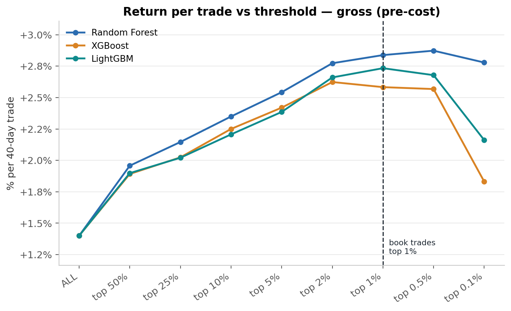

They did find signal, and on a pooled basis all three models look close: rank-IC of **+0.0487** for
Random Forest against **+0.0450** for XGBoost and **+0.0458** for LightGBM. If that were the whole
story, the boosters would be perfectly reasonable choices and about five times faster to train.

**The problem was what happened at the top.** Both boosters stop improving well before the book
trades, and then go backwards. XGBoost peaks at the top 2% and LightGBM at the top 1%; by the top
0.1% XGBoost has fallen to **+1.83%** a trade, which is worse than simply buying the top 25% of the
market. Random Forest keeps climbing through the top 0.5% and only eases at the very tip.

So the model would put its highest confidence on a group of names, and those names would underperform
the group below them. No matter which booster I used or how I fed it, the relationship broke down at
the highest deciles, which is exactly where I need it to hold.

That made the boosters effectively untradeable for what I'm doing. If the line stops rising past the
top 5%, what am I supposed to do with it? Pick between the top 5% and the top 1% on the basis of a
relationship that has already fallen apart? The whole strategy rests on tightening the threshold
buying me a better expected trade, and the boosters stopped delivering that right where it counts.

It also told me something about confidence. I'm looking for anomalies that resolve into an uptrend,
and a model that can't separate its best candidates from its merely-good ones isn't measuring those
events well.

My read on why comes down to how boosting is built. Boosted trees run in series, each one fitting the
errors of the last. That lets a feature, or a particular pair of features, get latched onto: within
the data available, whenever those sit above some level a high share of cases produced a certain
outcome, so the model leans on it. But there often isn't enough data behind that specific combination
to know whether the pattern is real. In a low-signal problem the sparsest regions are the extremes,
which is exactly the tail I trade.

A random forest handles this differently, and it's why I tried it. Every tree is fit on a bootstrap
sample, so it **sees about 63% of the rows and misses the other 37%**, and at every split it only
gets to consider **33% of the features**. Plenty of trees never see the feature or the combination
that would have produced that inconsistent signature, so they're forced to reach a decision without it.
Averaged across the whole forest, the model gets much better at telling apart a pattern that is
really there from one that merely showed up. Just because something occurred in the sample doesn't
mean it carries the probability the model wants to assign it.

That turned out to matter. Random Forest gave me the most promising relationship between threshold
and net return per trade of anything I tried, and it is the reason the decile ladder further down
reads as a clean staircase instead of a scatter. It also produces the widest decile spread of the
three (**+3.01pp** net from D1 to D10, against +2.64 and +2.61 for the boosters) and the most
negative bottom decile at **−0.91%** net, which is what makes the short-side idea worth looking at
in the first place.

The tradeoff is honest: Random Forest takes **20.7 minutes** to run the full six-fold walk-forward
against under **4 minutes** for either booster. For a model I retrain once a month, that's a price
worth paying.

## Method

**Label.** `cz` — the 40-day forward gross return, z-scored within each date, clipped at ±4. The
40-day horizon is matched to the ~42-session hold, so the model forecasts the window the book
actually holds.

**Walk-forward.** Six contiguous test windows tiling 2006-03-17 to 2022-12-30. Each fold refits from
scratch on an expanding window starting 1999-01-04, ending **63 sessions** before its test window
opens.

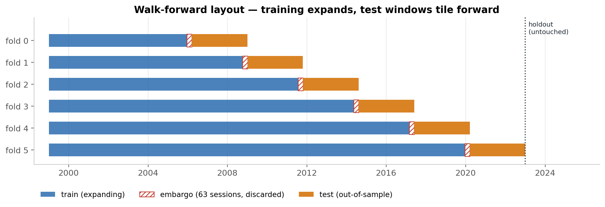

The embargo — the hatched gap between train and test — is not optional. The label is a forward
return, so a training row dated three weeks before the test window carries a label measured from
prices *inside* it. Cutting 63 sessions removes every label that reaches across the boundary. The
first 30% of eligible dates (1999-2006) is reserved train-only, which is why the dot-com bust informs
the model but never appears in an out-of-sample number, and the holdout on the right is never touched
by any of this.

**Training-set size.** Each fold trains on a random subsample capped at **500,000 rows**. Performance
plateaus around there: I re-ran the full six folds at a 1M cap and it came out marginally worse, so
500K is what I kept.

**Costs.** A liquidity-anchored spread curve calibrated with the EDGE estimator on sub-\$10M-ADV
stock-days, scaled by a bounded volatility multiplier and floored at one tick on the nominal price.
The full round trip is charged on the entry day. Median cost on this universe is **19.8 bp**, rising
to **30.5 bp** at the top 1% as picks concentrate into smaller names. The cost model is its own project. Market impact beyond the modelled curve, commissions, borrow locate and
recall, and Rule 201 are **not** modelled.

---

## Development — 2006-2022

### The signal ranks

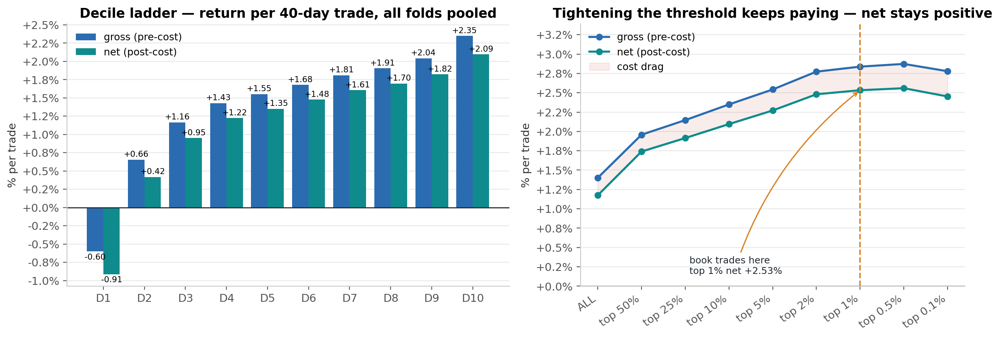

The ladder is monotone from **−0.60%** (D1) to **+2.35%** (D10) per 40-day trade, a spread of
**+2.95pp**, and return per trade keeps rising as the threshold tightens:

| threshold | picks/day | net % per trade | cost bp |
|---|---|---|---|
| all | 1,068 | +1.17% | 22.6 |
| top 10% | 107 | +2.09% | 25.4 |
| top 2% | 21.9 | +2.48% | 29.3 |
| **top 1%** | **11.2** | **+2.53%** | **30.5** |

That smooth staircase is the core claim of the project: the model is not just picking winners, it is
*ordering* the universe, and confidence in a large move rises as you climb the ranking.

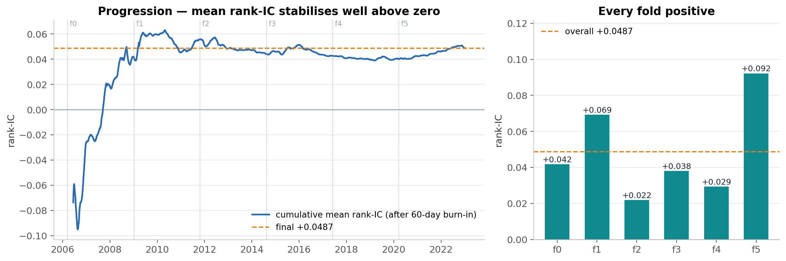

Rank-IC is **+0.0487** across 4,228 days, positive on **65.9%** of them, and positive in **all six
folds**.

**What that is worth: t = 5.58.** The t-statistic asks how big the average is relative to its own
margin of error: how many error bars from zero the result sits. Under 1 is noise, around 2 is the
conventional line, over 3 is strong. Two things about this particular number:

- It is computed on the **pooled series of all 4,228 days**, not fold by fold. A single fold holds
  32 to 54 genuinely independent observations once the 40-day overlap is accounted for, far too few
  to test on its own. The per-fold bars below establish that the sign is *consistent*; the
  pooled number is what establishes that the edge is *real*.
- It is **corrected for the overlap**. Consecutive days share 39 of their 40 label days, so treating
  4,228 days as 4,228 independent observations badly overstates the evidence. A Newey-West
  correction at 40 lags — matched to the label horizon — reduces the effective sample to about
  **228** genuinely independent observations and drops the t from a naive 24.0 to **5.58**.

At 5.58 the result clears even the strict bar that finance uses for a mined result (t > 3), which is
the strongest single claim in this project.

**Reading the "cumulative mean rank-IC" line.** That is the running average of every daily IC up to
each date, after a burn-in — so yes, it is essentially a cumulative Information Coefficient. It
answers one question: *has ranking skill been steady, or is the headline number carried by a few
good stretches?* A line that drifts up and then flattens is what you want. A line that spikes and
then decays would mean the edge lived in one regime and has since died.

**Why the correction runs out to 40 days.** Two days one apart share 39 of their 40 forward days, and
their ICs correlate about **+0.90**. Two days forty apart share none, and their correlation is
**−0.03** — effectively zero. The dependence vanishing exactly at the label horizon is what confirms
the overlap is causing it, and it is what sets the cutoff.

### The selection is not luck

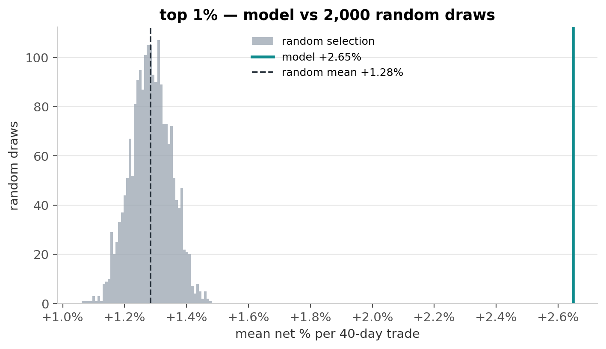

Holding the universe, the dates, the horizon and the cost model fixed and varying **only which names
get picked**, the model's top 1% returns **+2.648%** net per trade against a random-selection mean of
**+1.284%** — **21.0 standard deviations** above the null, with **0 of 2,000** random draws matching
it.

### From signal to portfolio

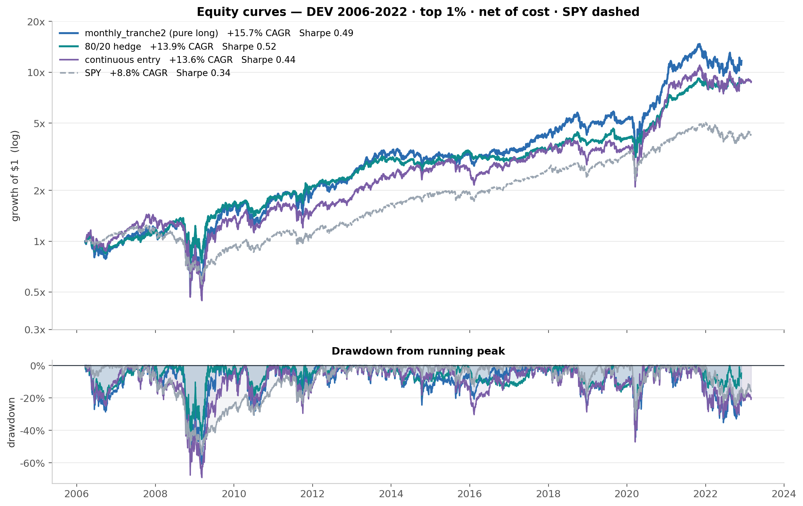

| DEV 2006-2022 | CAGR | vol | Sharpe | Sortino | maxDD | Calmar | Final X |
|---|---|---|---|---|---|---|---|
| pure long | +15.74% | 33.6% | 0.49 | 0.71 | −62.7% | 0.25 | 11.68x |
| **80/20 hedge** | +13.90% | 23.1% | **0.52** | **0.76** | **−50.3%** | **0.28** | 8.92x |
| continuous entry | +13.58% | 33.8% | 0.44 | 0.63 | −69.2% | 0.20 | 8.82x |
| SPY | +8.84% | 20.1% | 0.34 | 0.47 | −55.2% | 0.16 | 4.23x |

Sharpe and Sortino are excess of 3.75%. This hurdle is not neutral across books: the penalty is
`Rf / vol`, so SPY loses 0.19 of Sharpe where the pure long book loses 0.11. Quoting raw Sharpe would
reorder this table.

**On market exposure.** Against SPY the pure long book carries a **beta of 1.39** — it amplifies
market moves by about 39%. The 80/20 hedge sits at **0.82**. An equal-weight S&P 500 control, built
with the same execution machinery, comes in at 1.07 beta and essentially zero excess return
(+0.15%/yr), which rules out the reading that this is just the size tilt you get from equal
weighting.

---

## Is it just momentum?

The model ranks on trend and momentum features, so the fair challenge is that it may be an expensive
way to buy something simpler. Rather than argue this with a factor regression, it is easier to just
build the simpler things and look.

### Against a naive 12-month momentum sort

The first test holds *everything* constant except the ranking signal. Same universe, same top 1%
threshold, same monthly schedule, same cost model, same rows — the only change is that `ret_12_1`
replaces the forest's prediction.

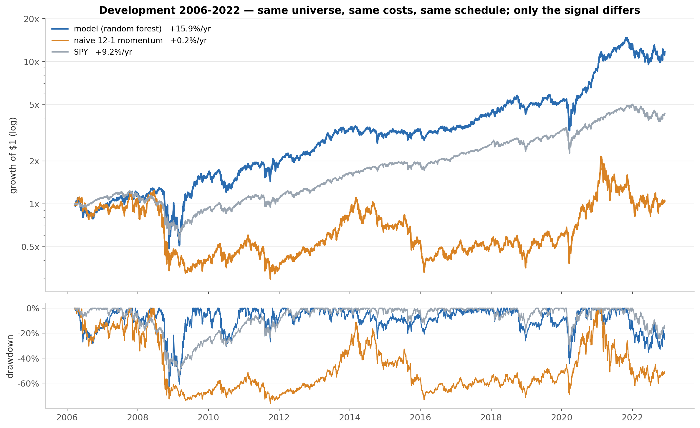

| DEV 2006-2022 | CAGR | vol | Sharpe | maxDD | Final |
|---|---|---|---|---|---|
| **model** | **+15.9%** | 33.6% | **0.49** | −62.7% | **11.68x** |
| naive 12-1 momentum | +0.25% | 43.1% | 0.14 | −76.2% | 1.04x |
| SPY | +9.2% | 20.1% | 0.35 | −55.2% | 4.32x |

**Sorting on momentum alone turned \$1 into \$1.04 over seventeen years**, while carrying more
volatility and a deeper drawdown than the model's book. It collapses roughly 70% in 2008 and never
recovers.

The reason is instructive. The top 1% by raw 12-month return selects the most extended names in the
universe — small, speculative, already-run — which is why it runs at 43% volatility. The model sees
momentum *alongside* trend quality, flow, liquidity and market state, and evidently uses them to
avoid the junk end of that distribution. **The value is not in finding momentum. It is in filtering
it.**

### Against a well-built momentum ETF

A tougher comparison: MTUM, the iShares momentum factor ETF — the off-the-shelf product you could
have bought instead. It launched 2013-04, so the overlap with development starts in 2015.

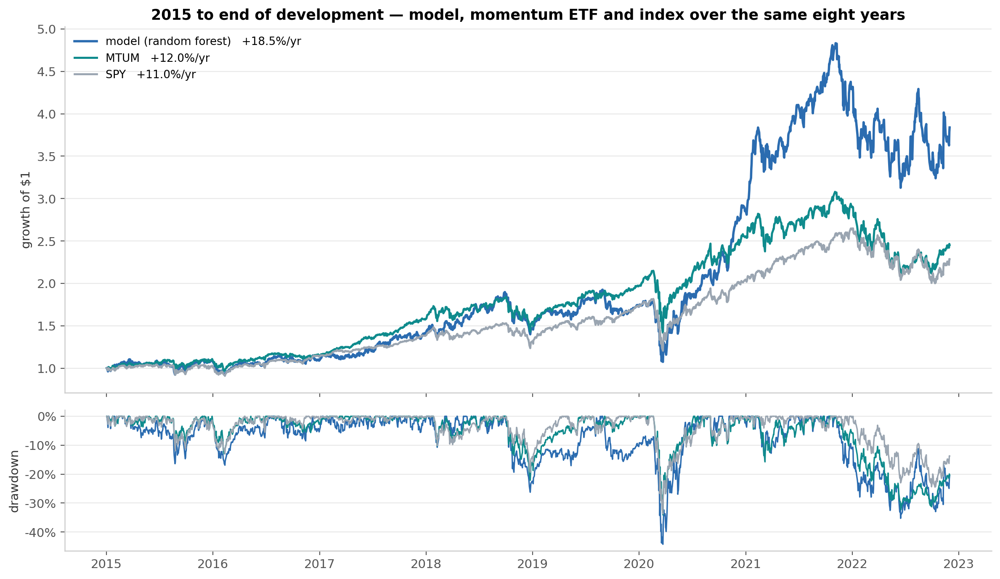

| 2015-01 → 2022-12 | CAGR | vol | Sharpe | maxDD | Final |
|---|---|---|---|---|---|
| **model** | **+18.5%** | 27.4% | **0.62** | −44.2% | **3.84x** |
| MTUM | +12.0% | 20.9% | 0.47 | −34.1% | 2.45x |
| SPY | +11.0% | 18.6% | 0.45 | −33.7% | 2.29x |
| naive 12-1 momentum | +5.7% | 43.6% | 0.26 | −62.0% | 1.55x |

Here the model wins on **Sharpe**, not merely on raw return — 0.62 against 0.47 — so the margin is
not just extra risk being taken.

But the chart says something the table cannot, and it is the more important finding: **the model
tracks MTUM almost exactly from 2015 until late 2020, and then diverges in a single burst.** For
nearly six years, through 2018 and through the COVID crash, the two lines sit on top of each other.
Essentially all of the outperformance arrives between roughly November 2020 and November 2021 — the
post-COVID melt-up, precisely the regime a concentrated top-1% book is built to exploit.

So the honest statement is narrower than the CAGR suggests: over this window **the model behaved like
the momentum ETF, until one regime where it did not**. That is the same pattern visible in the
holdout's sharp drawdowns and fast recoveries, and it is the direct evidence behind the
regime-sizing idea in [Where this goes next](#where-this-goes-next).

Worth noting separately: MTUM and SPY are near-indistinguishable across these eight years — +12.0%
against +11.0%, Sharpe 0.47 against 0.45, near-identical drawdowns.

Both windows above are development data, so they are in-sample for the model. They describe what
happened rather than test anything — the out-of-sample version of this comparison is in the
[holdout](#holdout--2023-2026), where the margin over MTUM disappears.

---

## Risk — what it feels like to hold

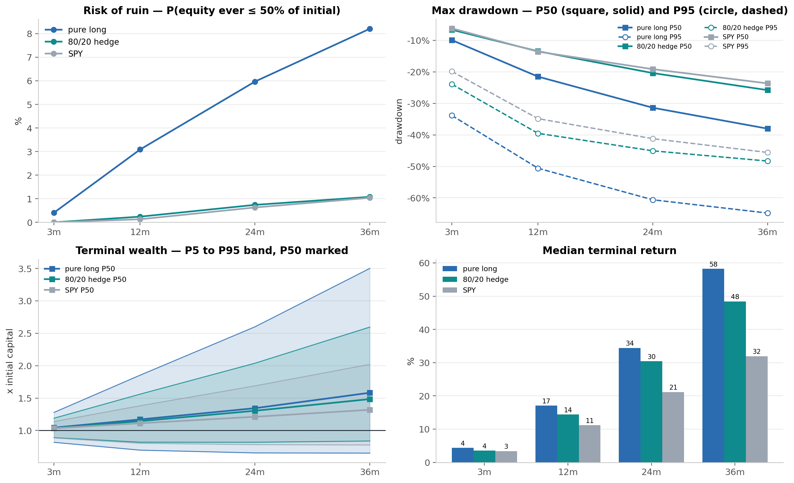

10,000 simulated paths per cell, drawn with a **circular moving-block bootstrap using 42-session
blocks**. A block is the unit that gets resampled, and **42 sessions is roughly two calendar months
of trading — the holding period**. Resampling in blocks that long means each simulated path
preserves the internal structure of a holding period: volatility clustering survives, and so do
losing streaks. Shuffling day by day would break streaks up, and streaks are what ruin is made of.
Ruin is defined as a path touching 50% of starting capital at any point.

| 36-month horizon | ruin | median return | maxDD P95 | CVaR 5% | P(loss) |
|---|---|---|---|---|---|
| pure long | **8.2%** | +58.2% | −64.8% | −49.4% | 18.5% |
| **80/20 hedge** | **1.1%** | +48.4% | −48.3% | **−28.7%** | **11.7%** |
| SPY | 1.0% | +31.9% | −45.6% | −33.1% | 18.4% |

**The hedge carries SPY's ruin risk with half again its return**, and beats SPY on downside tail,
5th-percentile wealth and probability of loss. The pure long book is the one that fails this test:
eight times the ruin risk for 10pp more median return, and the same ~18% chance of losing money as
SPY.

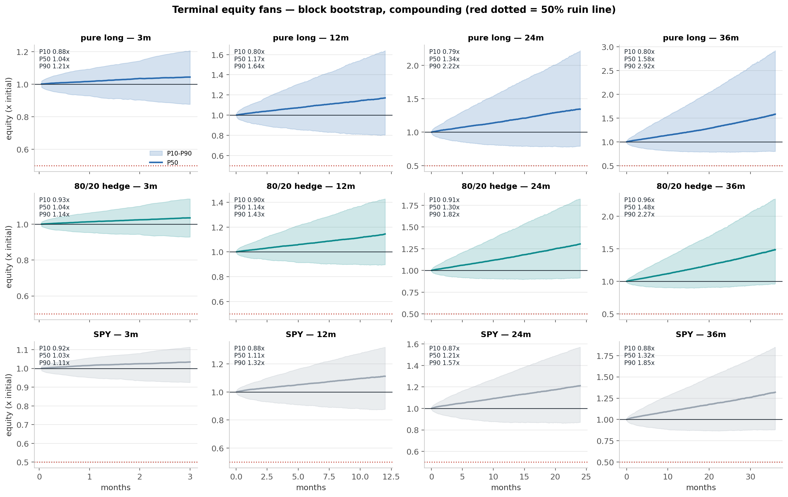

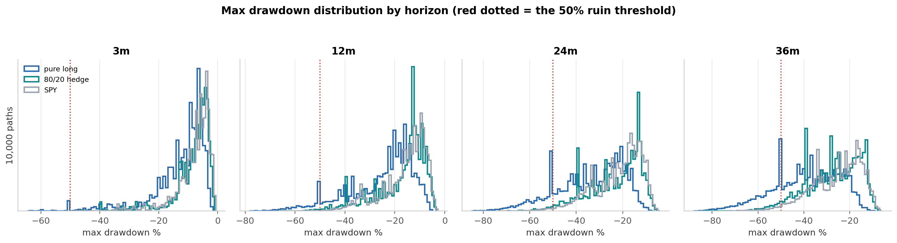

**These distributions are lumpy, and the lumps are informative.** They are not smooth bell shapes —
each has visible clusters, most obviously a pile-up just past −50% for the pure long book at the
longer horizons, where roughly 590 of 10,000 paths land in a single bin against ~300-400 in its
neighbours.

That is not an artifact. The block bootstrap resamples **real 42-session stretches of history**, so a
simulated path's worst drawdown depends largely on *which actual episodes it happens to catch*. Draw
the 2008 blocks and you get a 2008-shaped drawdown; draw the COVID blocks and you get that one. The
clusters sit at depths characteristic of the specific crises in the sample, which is why the
distributions are bumpy rather than smooth.

All three books show the same structure — pure long, hedged, and SPY alike — because all three are
measured over the same calendar and therefore contain the same crises. In this respect the model and
the index behave alike: both are hostage to the same handful of bad periods, and the practical
reading is that **if you deploy into one of those regimes, you will get something close to that
regime's drawdown**, whichever of the three you hold.

⚠️ It also marks the honest limit of this exercise. **A resampling method can only rebuild crises
that already happened.** It cannot invent one worse than the worst in the record, except by chaining
several together. So the right-hand tail here is bounded by history, and a genuinely novel shock is
not represented in it.

### Why a 3-year result cannot settle anything

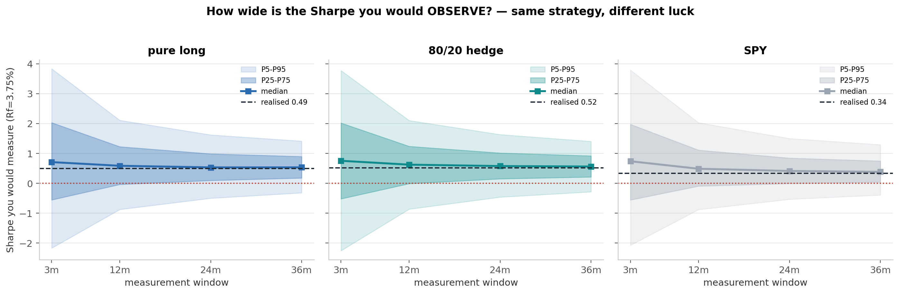

The strategy is **identical** in every simulated path; only sequencing luck differs. Measured Sharpe
over 3 months spans roughly ±3. At 36 months the band is still about [−0.3, +1.4]. This is noise in
the *measurement*, not uncertainty about the strategy — and it is why the holdout below cannot
cleanly separate the book from SPY whatever it shows.

### Methods check: the distributional assumption was tested

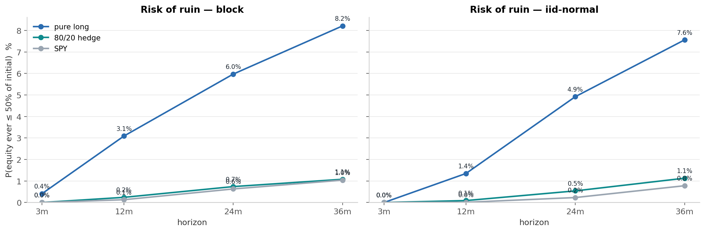

The right-hand panel is a **control, not a second result.** It runs the identical experiment under
the textbook assumption — returns drawn independently from a Normal distribution with the same mean
and volatility — so the two panels differ in exactly one thing: whether real-world clustering is
preserved. The gap between them measures **what assuming normality would have cost you.**

Ruin under the realistic block bootstrap runs **2.3–2.7x higher** than under an i.i.d. Normal at 12
months, converging by 36 as the central limit theorem takes over. That convergence is expected
behaviour, not a failure of the method. What *would* be alarming is agreement at short horizons —
that would mean the bootstrap was not preserving dependence at all, and the entire risk section would
be resting on an untested assumption. Excess kurtosis of 13–16 in the raw daily returns says the same
thing in advance: these returns are not Normal, and modelling them as Normal understates the tail.

---

## The hedge, and what it assumes

The decile ladder shows the bottom of the ranking identifies names that *underperform*, not merely
names that fail to outperform. That is what makes a short leg worth trying: the same model output,
used at both ends. The 80/20 hedge holds the long book at 80% weight and shorts the bottom 1% at 20%,
on the identical monthly schedule.

**The assumptions behind the short leg are strong, and every one of them is optimistic:**

| assumption | reality |
|---|---|
| Borrow costs a flat **8%/yr**, charged daily on the short weight | Borrow is name-specific and dynamic. The bottom 1% of a momentum ranking selects small, high-volatility, heavily-shorted names — exactly the hard-to-borrow bucket, where 20–100%+ is routine. |
| A locate is always available | Some of these names are simply unborrowable on the day you want them. |
| No recall | Lenders recall shares, often at the worst moment, forcing a buy-in. |
| Shorting is unrestricted | **Rule 201** restricts short sales to above the national best bid after a 10% intraday decline — which bites precisely in the crash regimes the hedge exists to protect against. |
| Short-side execution costs match long-side | The same spread + impact curve is applied to both, symmetric in the model and not in the market. |

The hedge's record is regime-dependent: it earned its keep across 2008 and 2022, and it was a drag
through 2023-2026. A fixed short weight is the wrong structure for something that regime-dependent —
see [Where this goes next](#where-this-goes-next).

---

## Holdout — 2023-2026

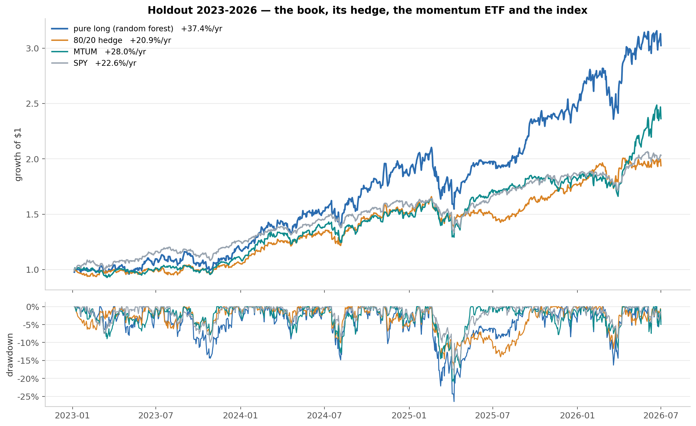

| HOLDOUT 2023-2026 | CAGR | vol | Sharpe | Sortino | maxDD | Calmar | Final X |
|---|---|---|---|---|---|---|---|
| pure long | **+37.36%** | 27.4% | 1.17 | 1.70 | −26.5% | **1.41** | **3.02x** |
| 80/20 hedge | +20.90% | 17.4% | 0.97 | 1.42 | −16.7% | 1.25 | 1.94x |
| MTUM | +27.98% | 20.8% | 1.12 | 1.63 | −21.0% | 1.33 | 2.36x |
| SPY | +22.57% | 15.2% | **1.18** | **1.75** | **−18.8%** | 1.20 | 2.03x |

All four series are measured over the identical 874 sessions, 2023-01-05 to 2026-07-01.

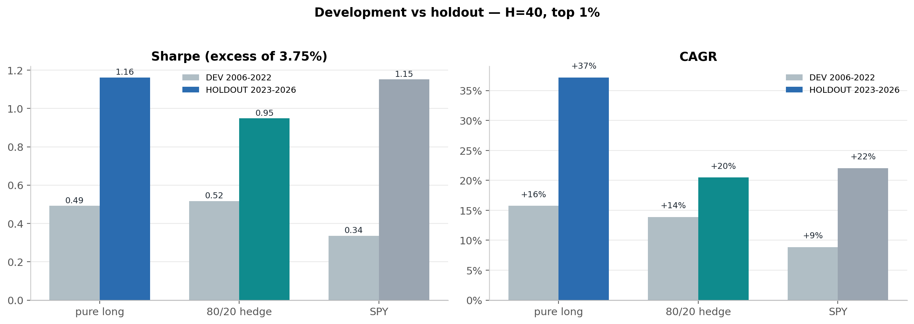

**The signal held, but weakly.** Rank-IC +0.039 against +0.049 in development — a 19% decay — with a
Newey-West t of **2.07**. On the scale used earlier that is right *at* the conventional line, not in
the "strong" range the development t of 5.58 sits in. It is the weakest significance anywhere in this
project, and it is what three and a half years of data buys you: the ranking is still there and still
pointing the right way, but a single mediocre stretch would have pushed it under the bar. Net return
per trade at the top 1% roughly doubled, and the selectivity sweep rose monotonically all the way to
the very top of the ranking — better behaved out of sample than in.

**The portfolio drew level.** Excess Sharpe of **1.17 against SPY's 1.18 and MTUM's 1.12** is a
three-way tie. The book won handsomely on total return — 3.02x against MTUM's 2.36x and SPY's 2.03x
— and on Calmar, but it paid for that with the deepest drawdown of the three at −26.5%. Risk-adjusted,
none of them separated.

### What the book actually is, in exposure terms

Beta answers a question the return table cannot: *what is this thing behaving like?*

| holdout 2023-2026 | beta vs SPY | R² vs SPY | beta vs MTUM | R² vs MTUM | vol |
|---|---|---|---|---|---|
| pure long | 1.33 | 0.54 | **1.05** | **0.63** | 27.4% |
| 80/20 hedge | 0.61 | 0.29 | 0.56 | 0.45 | 17.4% |
| MTUM | 1.16 | 0.71 | — | — | 20.8% |

Two things fall out of this.

**Against the momentum ETF the book's beta is 1.05 — essentially one-for-one — and MTUM explains
more of its movement than SPY does (R² 0.63 vs 0.54).** In exposure terms the book *is* a momentum
vehicle. It is not taking a leveraged bet on momentum; it is taking roughly a single unit of it.

**So the extra volatility is not extra factor exposure — it is concentration.** The book runs at
27.4% volatility against MTUM's 20.8%, but only 63% of its variance is explained by MTUM. The
remaining 37% is idiosyncratic risk from holding ~20 names instead of ~125. That is where the excess
return comes from, and it is also where the deeper drawdown comes from. They are the same decision.

That MTUM line is the out-of-sample version of the momentum comparison from development. In
development the model beat MTUM on Sharpe, 0.62 to 0.47. **Out of sample that margin disappears.**
The book still earns more, but per unit of risk it is indistinguishable from a momentum ETF you
could have bought for a few basis points — which is the single most sobering number in this
document, and the reason the summary at the top does not claim a risk-adjusted win.

**Context cuts both ways.** These three and a half years were a sustained bull market, and a
1.39-beta momentum book should do well in one. Deploying into this window was favourable timing and
the result should be discounted accordingly. What is genuinely encouraging, and is not just beta, is
the *shape*: the book took sharp drawdowns and recovered from them fast and hard. That recovery
profile is where momentum earns its reputation, and it shows up in the equity curve rather than in
any summary statistic.

**The hedge went the wrong way.** +20.9% against the pure long book's +37.4% and SPY's +22.6%. It did
what it is supposed to do on drawdown — −16.7% against −26.5% — but the short leg was a straight drag
on return through a rising market, and it finished behind on Sharpe too (0.97 vs 1.17). Read together
with development, where it helped through 2008 and 2022, the picture is consistent: **the hedge is
crisis insurance, and insurance costs money in the years you do not need it.**

---

## Who this is actually for

Stated plainly, because the numbers above can be read either too generously or too harshly.

**This model suits you if** you want concentrated exposure to momentum names with a real chance of
outperforming the index, and you are willing to accept volatility meaningfully above the market to
get it. On the evidence here there is a good probability it delivers that. It returned +15.7%/yr
against SPY's +8.8% in development and +37.4% against +22.6% out of sample.

**What you are signing up for is the volatility.** The book runs at 27-34% annualised against the
market's 15-20%, and in downturns you will feel it — a −62.7% peak-to-trough in development against
SPY's −55.2%, and the bootstrap says a worse path than that is entirely possible. This is not a
smoother way to own equities. It is a rougher one, in exchange for a shot at more return.

**What it does well is the recovery.** The model is good at identifying strong names coming out of
big drops, and that is where much of the outperformance is made. The equity curves show it
repeatedly: a sharp fall, then a faster and steeper climb back than the index manages. If you cannot
sit through the fall, you will never collect the climb, and you would be better off in the index.

---

## What this establishes

In descending order of confidence:

1. **The engineering is sound.** Point-in-time prices, real delistings and no survivorship bias,
   costs charged on entry, embargoed walk-forward, benchmarks built with the same execution
   machinery as the books.
2. **The model ranks stocks better than chance, and the ranking persisted.** 21 standard deviations
   above random selection in development; rank-IC +0.039 at t = 2.07 in the holdout.
3. **The original goal was met.** A tradable swing model driven by ordinary OHLC data plus VIX,
   executable entirely outside market hours, on a once-a-month cycle.
4. **Concentration is the dominant risk lever, and it is measurable.** Ruin over 36 months runs 8.2%
   for the pure long book against 1.1% hedged, for 10pp of median return — a direct consequence of
   how few names the top 1% supplies.
5. **The machine learning earns its keep over a naive sort.** Ranking on 12-1 momentum alone, with
   identical universe, costs and schedule, returned +0.25%/yr against the model's +15.9%.
6. **It is not established that the portfolio beats the index — or a momentum ETF — risk-adjusted.**
   Two test periods, two dead heats on Sharpe.

---

## Limitations

**Risk-adjusted, it does not clearly beat a momentum ETF you could just buy.** In development the
book beat MTUM on Sharpe 0.62 to 0.47, but out of sample the three-way comparison is a tie: 1.17 for
the book, 1.18 for SPY, 1.12 for MTUM. The book earns more in total return, and it takes more risk to
do it.

**The development margin over MTUM came from one regime.** From 2015 the two tracked each other
closely until late 2020, and essentially all of the outperformance arrived in the twelve months to
November 2021. An edge concentrated in a single regime is a thinner claim than an eight-year CAGR
gap suggests.

**No book beat SPY clearly on risk-adjusted terms in either test.** Development gave the hedge 0.52
against SPY's 0.34, which looks decisive — but the holdout was a three-way tie at 1.17 / 1.18 / 1.12, and the
Monte Carlo says a 3.6-year window cannot separate them either way.

**Drawdowns are severe, and worse than the index in a crash.** −62.7% on the pure long book in
development, −50.3% hedged, with bootstrap 5th percentiles of −81% and −64%. Like most momentum and
trend systems, the book takes sharper drawdowns than the S&P 500 during tail events — 2008 and COVID
are both plainly visible. Survivable on paper, hard to hold through. At the 36-month horizon the P95
longest stretch below the previous peak is 31–33 months out of 36, though the same is broadly true of
SPY.

**The very tip of the ranking is not monotone.** Net return per trade at the extreme top of the
ranking dips slightly below the level just beneath it. The model does not cleanly know its own single
best picks, even though it clears the top 1% threshold the book uses.

**Individual folds carry far less evidence than their day counts suggest.** Each fold spans ~705
sessions, but because trades overlap heavily, that is only **32 to 54 genuinely independent
observations** depending on the fold. Corrected per-fold t values run 1.20 to 5.02, and four of the
six sit below the conventional bar. This does not undercut the ranking claim, which rests on the
pooled series across all 4,228 days — but it does mean two things worth holding onto. The evidence
is real yet thinner than the raw sample size implies, so confidence should be firm rather than
absolute. And the spread of fold results, from +0.0219 to +0.0922, shows the edge is
regime-sensitive: it is much stronger in some market environments than others.

**The hedge has not been tested in the conditions it exists for.** A short leg is crisis insurance:
its job is to cushion a severe, broad drawdown. Development contained two such regimes — 2008 and
2022 — and the hedge helped in both. The holdout, 2023-2026, contained no comparable event, so it
offered no opportunity for the hedge to do the thing it is for. Its poor showing there (+20.9%
against the long book's +37.4%) is therefore weak evidence *against* it, in the same way that a
quiet year is weak evidence against fire insurance. The honest position is that the hedge remains
untested out of sample, not that it was disproven. Every assumption behind the short leg is also
optimistic.

**The dot-com bust is never evaluated.** 1999-2006 is 30% of development history and is reserved
train-only, so 2000-2002 informs the model but appears in no out-of-sample number.

**Costs are modelled, not measured.** No bid/ask in the data. Market impact beyond the calibrated
curve, commissions, borrow locate and recall, and Rule 201 are all absent, and all adverse.

**Sharpe uses a 3.75% hurdle** because the panel ships no risk-free series. Figures are not
comparable to any Sharpe computed at Rf = 0, and the hurdle penalises low-volatility books roughly
twice as hard as high-volatility ones.

**The liquidity floor is not a size screen.** No shares outstanding in the data, so market cap cannot
be computed; a high-turnover mid-cap outranks a sleepy mega-cap.

**The feature-selection work predates this data build.** The correlation clustering and permutation
importance testing that produced this feature set were done on an earlier iteration of the project;
the set was carried forward rather than re-derived against the current panel.

---

## Where this goes next

**1. Understand when this model works and when it struggles.** This is the highest-value open
question. The holdout showed the book taking rough drawdowns and then recovering aggressively, which
suggests return is concentrated in identifiable momentum regimes rather than spread evenly. If
healthy-momentum periods can be identified *ex ante*, exposure could scale with them — more capital
deployed when the regime supports it, less when it does not. That attacks the drawdown problem at its
source instead of paying a permanent hedge premium.

**2. Make the hedge conditional.** The same insight applied to the short leg. A fixed 20% short is a
permanent tax that pays off only in crises. The rule for turning it on has to be specified *before*
it is tested, or it is just curve fitting.

**3. Study the ranking's behaviour more closely, then optimise the trading method around it.** The
current schedule — monthly entry, top 1%, hold two months — was chosen early and never revisited
against what the ranking actually does day to day. How quickly does a name's rank decay? How much
does the top-1% cutoff move? Do the best trades come from names that just entered the top, or ones
that have held it for weeks? Answering that properly could produce a materially better entry and exit
rule than the one in place, and it is the cheapest improvement available since it needs no new data.

**4. Add data that isn't a commodity.** Everything here runs on open, high, low, close and volume —
data every investor already has, free. That is the point of the exercise, but it is also the ceiling:
if the inputs are a commodity, the signal built from them is going to be hard to keep unique. The
obvious extension is to add information that is *not* freely lying around — valuations and
fundamentals, balance-sheet quality, earnings revisions, market and single-name sentiment. If
ordinary price data alone gets to a rank-IC of +0.049 that survives out of sample, adding genuinely
informative data should improve on it rather than replace it. That is the direction I would take next.

---

## Appendix — the full feature list

**36 features reach the model.** 33 are converted to per-date cross-sectional percentile ranks, so
every value is "where this stock sits against every other stock today" rather than an absolute
number. The 3 market-wide series are left raw and winsorised, because a value that is identical for
every stock on a date would rank to 0.5 across the board and the feature would vanish.

### Trend and direction — 9

| feature | definition |
|---|---|
| `dist_sma20` | (close − 20-day SMA) ÷ 20-day SMA |
| `dist_sma50` | (close − 50-day SMA) ÷ 50-day SMA |
| `dist_sma200` | (close − 200-day SMA) ÷ 200-day SMA |
| `ma_ribbon` | dispersion of the 10/20/30/40/50-day SMA stack ÷ close — how compressed or fanned the ribbon is |
| `adx14` | Average Directional Index, 14-day — trend strength regardless of direction |
| `macd_dist` | MACD histogram (12/26/9) ÷ close |
| `donch_pos` | position inside the 20-day Donchian channel, 0 at the low and 1 at the high |
| `linreg30` | slope of a 30-day linear regression through close |
| `kumo_dist` | distance from the Ichimoku cloud midpoint ÷ close |

### Mean reversion and oscillators — 7

| feature | definition |
|---|---|
| `rsi14` | Wilder RSI, 14-day |
| `roc10` | 10-day rate of change |
| `stoch_k14` | stochastic %K, 14-day |
| `mfi14` | Money Flow Index, 14-day |
| `aroon_osc25` | Aroon oscillator, 25-day |
| `cmo20` | Chande Momentum Oscillator, 20-day |
| `rvm20` | 20-day mean of (daily return × relative volume) — moves that came with volume behind them |

### Momentum — 7

| feature | definition |
|---|---|
| `ret_20` | 20-day return |
| `ret_12_1` | 12-month return skipping the most recent month (the classic momentum construction) |
| `mom_3_1` | 3-month return skipping the most recent month |
| `mom_6_1` | 6-month return skipping the most recent month |
| `pct_52wk_high` | close ÷ 252-day high − 1 — how far off the yearly high |
| `fip` | sign of 12-1 momentum × the up/down-day balance — whether the move was a steady grind or a few jumps |
| `mom_consist` | share of the trailing 231 days with a positive 21-day return, lagged one month |

### Volume and flow — 6 · *ratios and z-scores only, never a level*

| feature | definition |
|---|---|
| `vol_ratio` | volume ÷ its own 20-day average |
| `vol_z` | 20-day z-score of volume |
| `updn_vol` | up-day volume ÷ down-day volume |
| `cmf20` | Chaikin Money Flow, 20-day |
| `flow_10` | (up-day dollars − down-day dollars) ÷ all dollars, over 10 sessions |
| `flow_63` | the same over 63 sessions |

### Liquidity and price level — 3

| feature | definition |
|---|---|
| `med_dv` | 63-session median dollar volume |
| `dollar_volume` | daily notional traded |
| `close_raw` | the price the tape actually printed — never the adjusted close |

### Other — 1

| feature | definition |
|---|---|
| `gap` | open ÷ previous close − 1 |

### Market-wide — 3 · *raw and winsorised, not ranked*

| feature | definition |
|---|---|
| `vix` | VIX level |
| `spy_dist200` | S&P distance from its 200-day moving average |
| `spy_5dvol` | S&P 5-day realised volatility |

### Built but deliberately excluded — 6

The pipeline also computes a per-stock volatility block — `ewm_sig`, `vol20`, `vol60`, `gk_vol`,
`vol_regime`, `atr14` — which the traded configuration (`--feats no_vol`) leaves out. These were in
the model originally, and taking them out was a deliberate decision.

Two problems showed up. The first is that six near-duplicate measures of a single concept was a
large share of the feature budget all voting the same way, which crowds out everything else. The
second is more subtle and is really about the label. Because the label is the forward return
**z-scored within each date**, a volatile stock has a wider spread of possible forward returns and so
lands in the extreme top of the ranking more often — not because the model identified something, but
because it has more variance. Given per-stock volatility as an input, the model can reach that
outcome directly, and it did: it leaned on volatility and underweighted the trend, momentum and flow
features that were supposed to be doing the work.

That is the same trap as putting cost in the label, arrived at from the other side. So the block was
pulled, which forces the model to reach its conclusions from the other feature classes. Market-level
volatility still reaches it through VIX and S&P realised vol, and some range information survives
indirectly in bounded features like `donch_pos` and `stoch_k14`. What the model does not get is a
direct read on whether *this particular name* is volatile relative to its peers.

Adding them back is a one-flag change (`--feats all`) if it is ever worth revisiting. Note that the
side-by-side comparison behind this decision was run in an earlier iteration and its numbers are not
preserved in this repo, so the reasoning above is the surviving record of it, not a result table.

---

## Reproduction

```bash
python sh_scan.py --build                                     # ~5 min, builds the panel
python sh_regress.py --smoke --h 40 --adv-floor 25e6          # cheap sanity check first
python sh_regress.py --h 40 --adv-floor 25e6                  # ~20 min -> OOS predictions
python sh_book.py --signal sh_oos_H40_cz_adv25.parquet --h 40 --adv-floor 25e6 \
    --thr 0.99 --tag h40_top1
```

The training-row cap defaults to 500,000 and is overridable with `--train-subsmp`.

`sh_regress.py` has a hard memory gate (`MIN_FREE_GB = 3.5`) and the panel alone is ~4.5 GB. Do not
run two panel-loading processes concurrently.

Then execute the notebooks, which write every figure into `report/figures/`:

| notebook | contents |
|---|---|
| `sharadar_results_v11.ipynb` | development evidence — gates, books, bootstrap, selection bar |
| `momentum_control.ipynb` | the "is it just momentum?" comparisons — naive 12-1 and MTUM |
| `comparing_models.ipynb` | RF vs XGBoost vs LightGBM |
| `monte_carlo_v11.ipynb` | ruin, drawdown, terminal wealth, Sharpe noise |
| `holdout_v11.ipynb` | the holdout |
| `report_summary_v11.ipynb` | master results table and the curated figure set |

| artifact | contents |
|---|---|
| `report/master_results.csv` | every book, both periods |
| `data_sharadar/mc_h40_top1_summary.csv` | book × horizon × sampler × sizing |
| `data_sharadar/sweep_6fold_500k_vs_1m.csv` | the rejected training-size experiment |
| `data_sharadar/run_*.log`, `books_*.log` | raw run output, kept for audit |

Run the smoke test after touching `sh_regress.py` or `sh_scan.py`. It has caught real bugs cheaply
before a long run hit them.

---

## Code Repository

[View on GitHub →](https://github.com/tenicho/ml-trend-momentum)
