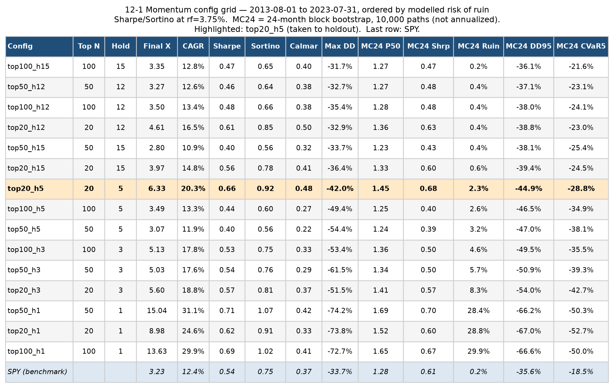
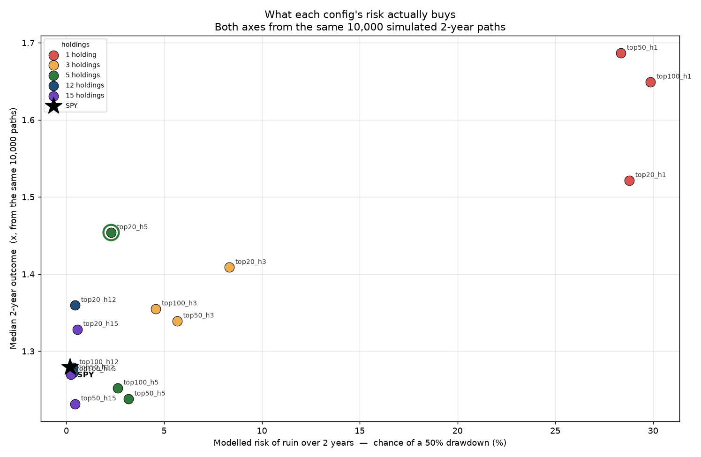
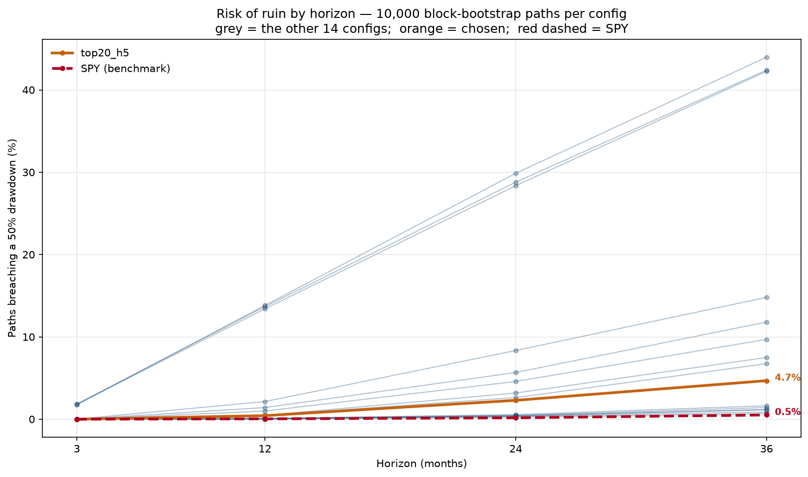
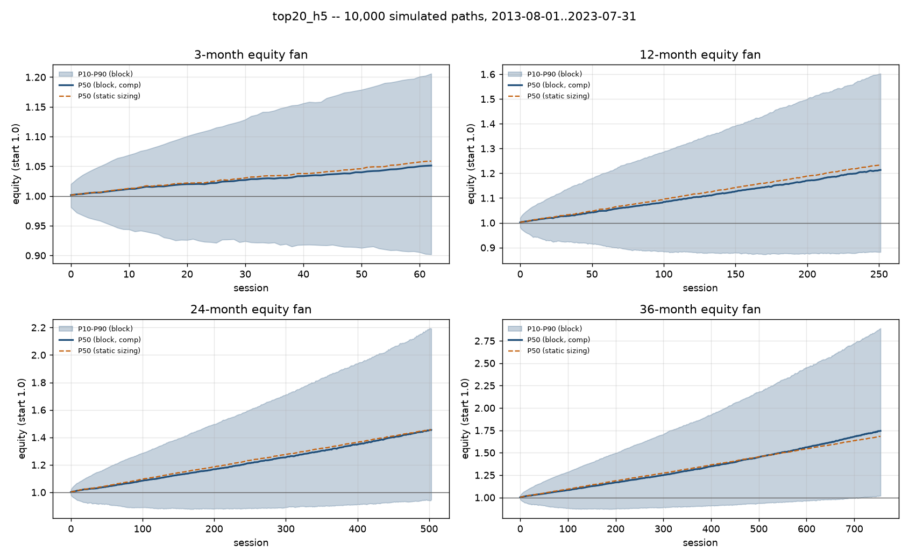
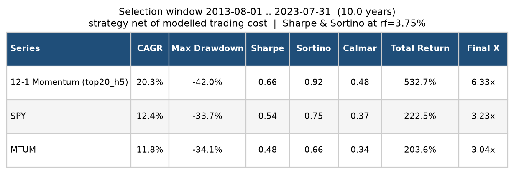
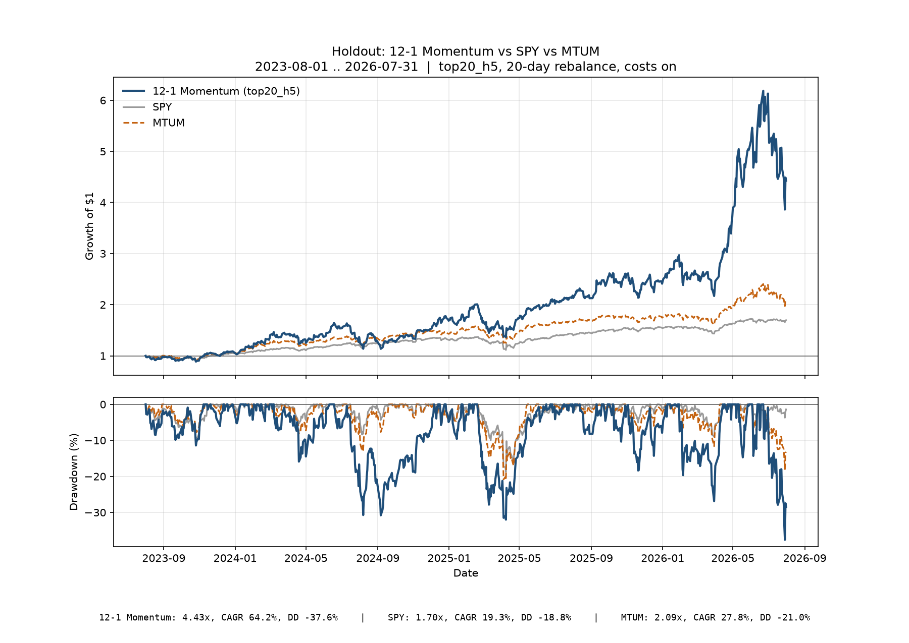
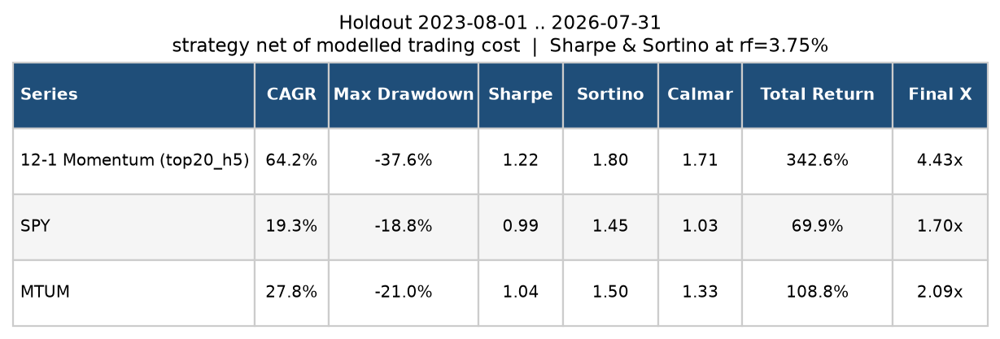
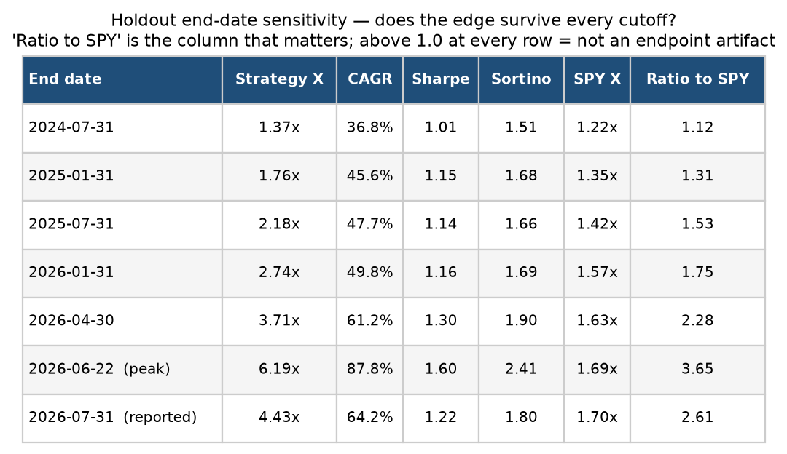
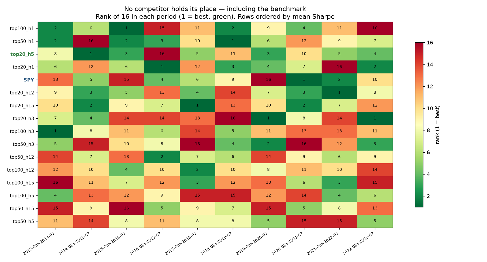

# 12-1 Momentum on the S&P 500

I wanted to see whether I could build a risk-adjusted trading strategy — a modified 12-1
momentum model — around a simple observation: **the S&P 500 does a good job of ranking
companies deservedly.** Over and over in my own investing the index has been right about which
businesses matter, which suggests there is opportunity in deliberately accepting concentration
risk to hold the names it has already elevated.

Concentration cuts both ways, and I went in knowing it: it can produce outperformance, but it
will certainly increase risk. What I wanted was a simple, repeatable mechanism I could
implement and run myself — something to capture a piece of the S&P 500's outperformers without
watching a screen during market hours.

This is what came out of it: a 12-1 momentum screen over point-in-time S&P 500 membership that
holds the 5 strongest names out of the 20 most liquid, equal weight, rebalanced monthly.

|             |                                                                                                       |
| ----------- | ----------------------------------------------------------------------------------------------------- |
| Strategy    | 12-1 momentum ranks point-in-time S&P 500 members; hold the top 5 of the 20 most liquid, equal weight |
| Data        | Sharadar US equity daily panel, survivorship-clean; scoped to 2013-08 onward (the panel starts 1998)  |
| Development | 2013-08-01 .. 2023-07-31 — 15-config grid, graded by Monte Carlo risk of ruin                        |
| Holdout     | 2023-08-01 .. 2026-07-31 (3 years, touched once)                                                      |
| Execution   | Monthly rebalance (20 trading days), equal weight, long only, no leverage                             |
| Costs       | Liquidity-anchored spread curve, full round trip charged on entry                                     |
| Benchmarks  | SPY and MTUM (both total-return ETFs)                                                                 |
| Grading     | Sharpe / Sortino against a flat 3.75% hurdle                                                          |

**In one paragraph.** The mechanism does what I set out to build, and it outperformed on both
sides of the split: **20.3%/yr against SPY's 12.4%** over the ten-year development window, and
**4.43x against SPY's 1.70x** (Sharpe 1.22 against 0.99) over the three-year holdout it was
tested on once. It is simple enough to run by hand on a monthly schedule. So the goal was met.
What I do **not** have is much confidence that the outperformance is *repeatable* rather than a
good run of concentrated equity exposure. Year by year the fifteen configs reshuffle completely,
and SPY reshuffles right along with them — see [Is it repeatable?](#is-it-repeatable). The risk
side is clearer, and it is the part I
would act on: concentration is the dominant measurable lever in the whole study, and the price
of it shows up plainly in the drawdowns — **37.6% against SPY's 18.8%** over the holdout, twice
the index. The most promising unexplored lever is reducing exposure during adverse market
conditions.

---

## Goal

The idea behind this started with a simple observation: names like NVDA, AAPL, and GOOG go on
runs that can drive exponential portfolio growth if you're in them and stay in them. The
question was whether there's a systematic way to get exposure to that kind of run without
taking on the risk of chasing whatever is hot at the moment.

My answer was to concentrate in businesses the market has already put its weight behind.
That's the appeal of the S&P 500 itself — to get in, and stay in, you have to be a real,
earning company, and the more successful you get the more your market cap grows and the higher
you climb in the index. With a few exceptions, if you're in the top 10% of the S&P you're
probably a strong, growing business the market has decided it likes. On top of that, being that
large means real organic flows into the name — index funds, benchmark-hugging managers, all of
it — which complements the momentum rather than fighting it.

I'll be upfront that I didn't go into this with a pile of research backing the thesis. It's
built on an observation from investing through this market: the top of the S&P has, for the
most part, been genuinely impressive companies — real growth, good margins, real tailwinds. In
a sense, the market is telling you which businesses are good, and that shows up as flows into
them. If that keeps holding, concentrating there and rebalancing on a schedule seemed like it
could beat just holding the index.

**The other requirement going in was that this had to be tradable without a lot of
hand-holding** — something I could run myself or hand to a bot, not something that needs
constant babysitting. That's why I settled on a monthly rebalance. I know that's an arbitrary
choice on its face, but I made it deliberately: I didn't want to test a grid of rebalancing
frequencies alongside everything else, because that just leads you to whatever frequency happens
to fit the training period best. Pick the frequency first, on a reason that has nothing to do
with the data, then hold it fixed.

So the setup came down to three fixed pieces — universe (S&P 500), signal (12-1 momentum),
rebalance (monthly) — and two knobs I let vary: how far down the index to go (the top 100 down to
the top 20) and how many names to hold. The top-100-to-20 range is the same idea as the core
thesis: stay with companies the S&P has already given its stamp of approval to, and cut out the
smaller names that go on wild rides for reasons that have nothing to do with what I'm actually
trying to capture.

`num_holdings=1` is more of an experiment than a real candidate. I went in knowing a single
name is going to be too dependent on whichever stock happens to be dominating the index in a
given stretch, and too volatile on top of that. It's in the grid because I was curious how it
would actually behave, and because if a single name *did* end up ruling a period, the
multi-holding configs would still capture a piece of it.

**Where this differs from an existing product.** MTUM runs a related idea, and it is the
closest thing to this on the shelf: a blend of 6- and 12-month price appreciation, scaled by
3-year volatility, across a large- and mid-cap universe, held in roughly 125-130 names. Three
deliberate departures from it:

**I accept volatility; MTUM tries to damp it.** Their model divides the momentum score by
3-year volatility, which systematically pushes the wildest movers down the ranking. But the
stocks that go on the runs I'm trying to catch are *inherently* volatile — that's most of what
a run looks like from the outside. Damping it filters out part of the thing I'm after. I do
review volatility when analysing the models; I just don't let it into the ranking rule.

**I concentrate, and I concentrate high in the index.** MTUM holds ~125 names, which is
diversification. I hold 5, drawn from the top 20 by liquidity. The thesis is that a company
which has worked its way into the top 20-50 of the S&P has been *deemed deserving* by the
market. The market isn't always right, but that filter leaves me with names that have already
earned respect and that carry real structural flows — index funds, benchmark-hugging managers —
pushing the same direction as the momentum rather than against it.

**Smaller companies are more volatile, and that's a different kind of volatility.** I'm fine
with volatility that comes from a business compounding fast. I'm less interested in volatility
that comes from being small. This is intuition rather than a tested claim, stated plainly as
such: the odds that Apple falls 50% are lower than the odds a $10bn company does. The
top-100-down-to-top-20 range exists to stay on the right side of that.

So I stuck with plain 12-1 on a narrow, high-conviction slice of the index — to see how the
simple, concentrated version performs before adding the machinery MTUM uses.

---

## Data

Sharadar US equity daily panel: **41.8M rows**, 7,188 trading sessions, with point-in-time
S&P 500 membership and corporate actions. The panel starts 1998-01-02; this study reads it
from **2013-08-01** (see [Scope](#scope)).

What matters for this study, counted over the study era only — 2013-08 to 2026-07:

- **762 distinct tickers** have been index members at some point in this era, against **503
  today**. 259 have dropped out. That gap is the survivorship bias a current-constituents
  screen would bake in, and it is large even over thirteen years.
- **157 of those 762** stop trading before the panel ends. Their bars are real and their
  last bar *is* the delisting.
- Membership holds at 500–505 names per session throughout.

### The one gap that changes what the strategy actually is

**The panel has no shares outstanding, so market capitalization cannot be computed at all.**

That matters because the thesis is about *size and standing* — a company that has climbed into
the top 20 or 50 of the index has been deemed deserving by the market. The natural way to
express that is to rank by market cap. I can't. What `top_n_universe` actually ranks on is
**21-day median dollar ADV** — average daily trading volume in dollars.

So when this report says "the top 20", it means **the 20 most heavily traded S&P 500 members**,
not the 20 largest. The two overlap heavily at the top of the index — the mega-caps are also
the most traded — but they are not the same screen, and where they diverge the difference is
adverse to the thesis:

- A mid-cap in the middle of a news cycle can out-trade a quiet mega-cap and enter the
  universe on turnover alone.
- Volume spikes on distress as readily as on strength, so the screen can pull in exactly the
  churning names the "market has already blessed it" argument is meant to exclude.

Everywhere the report describes the universe in size language, read it as a liquidity screen.
This is the largest gap between the stated thesis and the implemented rule, and no result here
resolves it.

One related trap worth stating, since it would have made the screen worse: the panel's volume
column is split-adjusted, and its level leaks forward returns — a stock that split later reads
as having traded more today. All liquidity work uses raw dollar volume instead.

Also absent: fundamentals, bid/ask spreads, and any risk-free rate series.

---

## Method

### Scope

Every number in this report comes from **2013-08-01 onward**. The panel reaches back to
1998 and that earlier history is not used — not as a robustness check, not as a footnote.
The selection window is the ten years ending where the holdout begins; the holdout is the
three years after it.

**Why 2013.** I wanted to test this in what I'd call the modern investing era — the stretch
where retail participation became a real force in how these names trade. Markets have changed
enormously over 20 or 30 years, and the flows argument underneath my thesis (index funds,
benchmark-hugging managers, retail concentration into the largest names) is a description of
*recent* market structure, not of 1999. Testing against an era where that structure didn't
exist would be testing a different question.

At the same time I wanted enough history to be worth backtesting, and enough to include a
genuine adverse event. Ten years gets both: roughly 126 rebalances, and COVID inside the
selection window.

**I'll state plainly that this is a qualitative assumption, and I accept pushback on it.** I
could have run it back further. I chose not to, and the ten-year duration is arbitrary — I
picked a round number that kept the test recent. I'd also note the argument cuts against itself
a little: retail participation two years ago is not what it was ten years ago either, so "the
modern era" isn't a clean, homogeneous thing. Nothing in this report tests the boundary, and a
reader who thinks 2013 is the wrong line should discount everything downstream of it.

Two consequences worth naming up front. The good one: MTUM's inception is 2013-04-18, so
the momentum-factor comparator exists for the entire study rather than for part of it. The
costly one: ten years is a short window to ask fifteen questions of, and
[Limitations](#limitations) shows it cannot separate them.

**Signal.** At each rebalance, take point-in-time index membership, keep the `top_n_universe`
most liquid names by 21-day median dollar ADV, rank by `price(t−1mo) / price(t−12mo) − 1`, buy
the top `num_holdings` equal-weight, hold 20 trading days, repeat. The most recent month is
excluded to avoid short-term reversal.

**Delistings.** A position whose name stops trading mid-period is realized at its last real bar
and that sleeve holds cash until the next rebalance. This cuts both ways: a collapse is
charged, and an acquisition no longer receives a free ride. In practice, across the whole
grid, seven names were held into a delisting over the study era — AGN, AGN1, CELG, COV,
TFCFA, TWC, XLNX — and every one was an acquisition: momentum buys winners, and winners get
bought. **None of them reached `top20_h5`'s book.** For the chosen config the delisting
path is verified but never binds, so it protects the grid comparison, not the headline
number.

**Costs.** A liquidity-anchored spread curve scaled by a bounded volatility multiplier, floored
at one tick on the *nominal* price, times a 0.85 effective ratio. The full round trip is charged
on the entry day. For this universe the median cost is **5.6 bp** and **0%** of trades fall
below $100M ADV, so the model's interpolation gap never binds. Drag is ~0.5%/yr at a 20-day
hold. **Market impact and commissions are not modelled.** (The short-selling costs the cost
model's spec also excludes — locate, recall, Rule 201 — do not apply here: this book is
long-only and unlevered.)

**Monte Carlo.** 10,000 paths per config from a block bootstrap (42–63 session blocks) over
daily portfolio returns, at horizons of 3, 12, 24 and 36 months, with an i.i.d.-normal control
and both compounding and static sizing. Sharpe and Sortino are graded against a flat 3.75%
annualized hurdle. "Ruin" is a path falling 50%+ below its own peak — literal $0 is unreachable
for a long-only unlevered book.

**The grid.** `top_n_universe` at {20, 50, 100} and `num_holdings` at {1, 3, 5, 12, 15} — 15
combinations of the two knobs described in the Goal, everything else held fixed. `h1` is the
one-name experiment; it's expected to be too dependent on a single dominant name and too
volatile, and it's included specifically to see how badly and to give the other holdings counts
something to be measured against.

**Selection discipline.** The grid is evaluated on the selection window only, and the config
is chosen before the holdout is touched. Because ten years cannot separate fifteen configs on
return — see [Training](#the-fifteen-configs) — the choice is made on modelled risk, where the
differences are large and driven by a parameter I set directly.

---

## Training — selection on 2013-08 to 2023-07

### The fifteen configs



Every cell of the grid run on the selection window with costs charged, ordered by modelled risk
of ruin, with SPY on the same footing at the bottom.

Read it top to bottom and the structure is immediate: **risk of ruin climbs from 0.2% to 29.9%
and max drawdown from −32% to −74%, and it is holdings count that drives both.** The
twelve-and-fifteen-name configs cluster at the top, the single-name configs sit at the bottom,
and the universe size barely matters by comparison.

Now read the return columns the same way, and no such structure appears. `top50_h1` posts the
best Sharpe (0.71) and the best CAGR (31.1%) — and holds one stock, with a −74.2% drawdown and
a modelled 28.4% chance of halving within two years. It is uninvestable at any Sharpe. Meanwhile
`top100_h1` and `top50_h5` sit 0.25 of Sharpe apart with no obvious reason why.

**The Sharpe column cannot separate these configs, and ten years of data never could.** A
Sharpe is an average return divided by a volatility, and the average is estimated from a
sample, so it carries sampling error that shrinks only with the square root of how much data
you have. Ten years pins a Sharpe down to about **± 0.34** — and that figure is a property of
the window, not the strategy: it barely moves whether the true Sharpe is 0 or 1.0. The distance
between the best config in this grid (0.71) and the worst (0.40) is **0.31**, smaller than the
margin of error on any one of them.

That is a ceiling on what any decade-long backtest can resolve, not a defect in this grid.
Halving the margin would take forty years of data. Whether the ordering *actually* holds up is
a separate and more useful question, answered with evidence rather than formulas in
[Is it repeatable?](#is-it-repeatable) — and the answer there is no.

### What the risk actually buys

The Monte Carlo *can* tell these configs apart, because risk here is driven by how many stocks
you hold — something chosen directly — rather than by estimating an average return from noisy
data. Both axes below come from the same 10,000 simulated 2-year paths, so this is a like-for-
like comparison rather than a realized number plotted against a modelled one:



Holdings count organises the entire picture, and the shape is the decision this study is
actually making: not "which config is best," but **how far along that trade-off to sit.**

**`top20_h5` was chosen**, and this chart is what justifies it rather than the return columns. It
sits on the **efficient frontier** — nothing in the grid delivers both a higher median outcome
*and* lower ruin. More usefully, it strictly beats five of the other fourteen on both counts at
once:

| | modelled 2-yr ruin | median 2-yr outcome |
|---|---|---|
| **`top20_h5`** | **2.3%** | **1.45x** |
| `top100_h5` | 2.6% | 1.25x |
| `top50_h5` | 3.2% | 1.24x |
| `top100_h3` | 4.6% | 1.36x |
| `top50_h3` | 5.7% | 1.34x |
| `top20_h3` | 8.3% | 1.41x |

Each of those takes more ruin risk and returns less for it. That is a real ordering, and unlike
the Sharpe column it does not depend on separating numbers that sit inside each other's error
bars. What remains is a genuine trade: `top20_h12` gives up 0.09x of median outcome to cut ruin
from 2.3% to 0.45%, and the `h1` cells buy 0.23x more median outcome for 28% ruin.

### How that risk builds with time



The chance of a 50%-deep drawdown, at 3, 12, 24 and 36 months. Risk climbs with horizon simply
because a longer path is more chances at a bad sequence. Holding 12–15 names sits at 0.2–0.6%
over two years; holding one name sits at 28–30%. Same signal, same universe, same everything
else — position count moves the risk by a factor of roughly a hundred, and no statistical test
is needed to see it.

`top20_h5` sits at **2.3% over two years, 4.7% over three**.

### What 10,000 alternate histories look like

The Monte Carlo takes the chosen config's actual daily returns and reshuffles them in 2–3 month
blocks — preserving the streaky, fat-tailed character of real markets rather than assuming one
day is independent of the last — then replays 10,000 versions of the next 3, 12, 24 and 36
months.



The honest reading of the 36-month fan is that **the downside is flatter than the headline
suggests**:

| out of 10,000 simulated 3-year runs | ends at |
|---|---|
| worst 10% | **1.02x — three years for nothing** |
| middle | 1.74x |
| best 10% | 2.89x |

The median outcome is a strong three years and the top decile is excellent. But roughly one run
in ten spends three full years going nowhere, **9.2% end below where they started**, and the
median run spends about **249 sessions — a full year — underwater**, below its own previous
high. Sitting through that is the actual experience this strategy asks for.

### Why 5 holdings and not 12

`top20_h12` looks better on most of the stability measures, and that's a real argument:

|                            | `top20_h5`    | `top20_h12`     |
| -------------------------- | --------------- | ----------------- |
| CAGR, selection window     | **20.3%** | 16.5%             |
| max drawdown               | −42.0%         | **−32.9%** |
| Calmar                     | 0.483           | **0.503**   |
| modelled 2-year ruin       | 2.3%            | **0.45%**   |
| median 2-year outcome (MC) | **1.45x** | 1.36x             |

So going from 5 names to 12 costs roughly **4 points of annual return** and buys about 9 points
less drawdown and ~1.9 points less ruin risk. On the pure risk-adjusted measures, 12 wins.

I chose 5 anyway, and it is a subjective call rather than one the data forces:

**At 12 holdings out of a 20-name universe, you're most of the way to just owning a concentrated
S&P fund.** The whole premise here is accepting concentration risk deliberately to capture the
index's strongest names. Diluting to 12 gives up much of what the strategy is *for* — and if
that's where I'm going to land, buying an existing product is the simpler and cheaper route.

**The upside skew is what I'm paying for, and the trade is lopsided in my favour.** Comparing
the two configs across the full simulated distribution rather than at the median alone:

| 10,000 simulated 3-year runs | worst 10%         | middle           | best 10%         | end below start |
| ---------------------------- | ----------------- | ---------------- | ---------------- | --------------- |
| `top20_h5`                 | 1.018x            | **1.744x** | **2.890x** | 9.2%            |
| `top20_h12`                | 1.034x            | 1.589x           | 2.377x           | 8.4%            |
| **difference**         | **−0.016** | **+0.155** | **+0.513** | +0.8pp          |

Going to 5 holdings costs **0.016x at the 10th percentile** and gains **0.513x at the 90th** —
roughly a thirty-to-one trade. The chance of ending underwater barely moves (9.2% against 8.4%).
Concentration here is not buying a shifted distribution so much as a **longer right tail**, which
is precisely the thing the strategy exists to capture.

**Where the concentration does cost is the ride, not the destination.** The same simulation:

|                               | `top20_h5`      | `top20_h12` |
| ----------------------------- | ----------------- | ------------- |
| typical worst drawdown, 3yr   | −31.8%           | −25.0%       |
| bad-case drawdown (95th pct)  | **−49.5%** | −42.6%       |
| chance of a 50% drawdown, 3yr | **4.7%**    | 1.4%          |
| median time spent underwater  | 249 sessions      | 240 sessions  |

So the honest statement of the trade is: about the same odds of making money, a materially
better upside, and roughly 7 more points of drawdown to sit through while you wait. I'd rather
take that than optimize a ratio — but it is a tolerance question, not a mathematical result, and
someone who can't hold through a −50% drawdown should take the 12.

I'll note the counter-argument stands: the drawdown difference is real, it showed up in the
holdout (−37.6%), and it is the reason exposure reduction is named as the next lever rather
than more concentration.

### The chosen config against the benchmarks

With `top20_h5` settled, here are all three series over the selection window on identical
footing — same dates, same 3.75% hurdle, costs charged on the strategy only:



Worth noting that **MTUM underperformed SPY over this decade** (11.8% vs 12.4% CAGR, Sharpe
0.48 vs 0.54). The momentum factor itself was out of favour during the very window this config
was selected on — which matters later, because it turned favourable exactly when the holdout
opened.

---

## Holdout — one shot on 2023-08 to 2026-07





The strategy beat both benchmarks on all seven metrics. It also *improved* on its selection
window — Sharpe 0.66 → 1.22, Sortino 0.92 → 1.80, Calmar 0.48 → 1.71 — which is the opposite of
what selection bias produces, and therefore evidence about the regime rather than about the
config.

The window ends mid-drawdown: the strategy peaked at 6.19x on 2026-06-22 and closed 28% below
that. So the headline multiple depends partly on where the data stops.



The **Ratio to SPY** column is the one that matters. It is above 1.0 at every cutoff and rising
(1.12 → 3.65), so the outperformance is a property of the period, not of the endpoint. Had it
dipped below 1.0 anywhere, the headline would be an artifact.

### How much weight I put on this

Not much — and that is about how the test was built, not how it performed.

This design does exactly what it is supposed to do in a market like the one we have just had:
a strong tape, earnings growing, and a handful of mega-caps carrying the index. It is built to
find the NVDAs and Apples and stay in them, and over these three years that is what it found.
The results are genuinely good. But a window with no crash in it is close to the best case for
a concentrated momentum book, so I read this as a favourable draw at least as much as a passed
test.

Seeing numbers this strong is what pushed me to look harder rather than stop. The question it
raised was the obvious one: **if I had switched this on at some other point, would it still look
like this?** That is what the next two sections work through, and the answer is more sobering
than the multiple above.

---

## Is it repeatable?

The holdout can't answer that on its own. It's one three-year stretch, and if this only works
when the market hands it a run of mega-cap winners, the holdout would look exactly the way it
does. So I went back to the selection window and asked a different question — not "did it win,"
but "does it keep winning, and for the same reasons?"

### The ranking doesn't hold up

I cut the ten years into ten one-year periods and scored all fifteen configs in each one.



Read down any column and there's no pattern. A config near the top one year is about as likely
to be near the bottom the next. `top20_h5` finishes 1st in one year and dead last in another.
The closest thing to a consistent result in the whole table is `top100_h5`, which lands in the
bottom half seven years out of ten — and that's a config nobody would pick anyway.

One check before trusting that, because a rank table throws away size. If all fifteen were
bunched together inside a year, then 1st versus 14th would be a rounding difference and the
shuffling would be an artifact of ranking rather than a real fact. They aren't bunched: in a
typical year the best config beats the worst by about **1.07 of Sharpe**. When a config drops
to 14th, it genuinely had a bad year.

To put one number on it, I compared every year against every other year — 45 comparisons — and
measured how much the two orderings agree. That scale runs from **+1** (identical order) to
**0** (no relationship) to **−1** (exactly backwards). The average came out at **−0.02**.

That's zero. Knowing which config won last year tells you nothing about which one wins next
year. And it isn't an artifact of using short windows — run the same comparison on two-year,
two-and-a-half-year and three-year periods and the answer stays flat at zero.

I've left significance testing out of this. That machinery is for deciding whether a number
that *looks* like something is real. −0.02 doesn't look like anything.

### But SPY does the same thing

SPY is in that table too, as a sixteenth competitor. Its finishing places, year by year:

```
13   5   15   4   6   9   16   1   2   10
```

First one year, dead last another, and squarely average across the ten.

SPY isn't a strategy. There's nothing to configure and nothing that could have been chosen well
or badly. It doesn't get better or worse at its job from one year to the next. It still moves
around the table as much as anything I built.

So the shuffling isn't evidence that these configs are broken. Something with no moving parts
does it too.

What's actually driving it is that they're all riding the same market. Lining up each config's
ten yearly Sharpes against SPY's ten, they track each other at **+0.53 on average**, and at
**0.74 to 0.86** for the 12- and 15-name configs. That last part makes sense: hold more names
out of the same universe and you're closer to just owning the index, so your good and bad years
become the index's good and bad years.

**There's no config-selection edge here. What I'm really choosing is how much equity risk to
take.**

### And the drawdowns are worse

If these are riding the market, the question becomes how hard they ride it when the market turns
down. Worse than one-for-one:

| | strategy | SPY | MTUM |
|---|---|---|---|
| max drawdown, development | −42.0% | −33.7% | −34.1% |
| max drawdown, holdout | **−37.6%** | **−18.8%** | −21.0% |
| worst single year | −0.48 Sharpe | −0.32 | — |

Over the holdout it drew down twice as deep as the index, holding five names against SPY's five
hundred. That's the concentration bargain working exactly as expected in both directions.

The problem is that nothing in the strategy responds to it. Position count is fixed, weights are
fixed, and it stays fully invested through every regime — the rebalance rule only ever asks which
names have the strongest momentum, never whether to be in the market at all.

That's the gap this leaves open, and where I'd put the next round of work: **cutting exposure
when conditions turn.** A concentrated book with no de-risking layer is the one part of this
design that's plainly unfinished rather than just unproven.

---

## Results

What the evidence supports, in descending order of confidence:

1. **Concentration is the dominant risk lever, and it is the one thing here that is precisely
   measurable.** Holdings count moves modelled 24-month ruin from 0.2–0.6% (12–15 names) to
   28–30% (1 name) — a factor of about a hundred, driven by a number I choose rather than one
   I have to estimate. It shows up in realized results too: the strategy drew down 37.6% over
   the holdout against SPY's 18.8%.
2. **What varies from year to year is the market, not the config.** See
   [Is it repeatable?](#is-it-repeatable) — the config ranking reshuffles completely between
   periods, and SPY reshuffles with it. The differences *between configs* cannot be separated;
   the differences *between years* are large and shared by everything, the index included.
3. **The strategy outperformed over the holdout**, on every metric, at every cutoff. Whether
   that reflects skill or a kind three years is not something three years can answer — the
   Monte Carlo says a run this good is well within what the strategy produces by chance.
4. **It is not established that this generalizes**, and the strategy has no mechanism for
   reducing exposure when the market turns against it.

---

## Limitations

**Starting in 2013 was a judgment call, not a finding.** I picked it because I wanted this
tested in the modern era (see [Scope](#scope)), and nothing in this report checks whether that
was the right line to draw. Every number here sits on top of that choice. If you don't buy the
choice, discount the rest.

**I got a lucky holdout.** The results are real, but the window was kind. It holds 45% of the
study era's growth in 23% of the elapsed time, and it contains no crash — COVID sits on the
training side, so the config was picked partly for crash resilience and then tested where there
was no crash to survive. On top of that, momentum as a factor turned favourable exactly when the
window opened: MTUM lagged SPY through the selection decade and beat it by 8.5 points of CAGR
over the holdout. Some of what looks like my edge is the factor having a good run.

**Three years is 38 rebalances.** That is not enough to tell skill from luck in either
direction, whichever way the numbers had come out.

**`top_n_universe` is a liquidity screen, not a size screen.** There are no shares outstanding
in the data, so market cap can't be computed. A high-turnover mid-cap outranks a sleepy
mega-cap. This is the biggest gap between what I set out to build and what the code actually
does — see [Data](#data).

**Costs are modelled, not measured.** There's no bid/ask in the data, and neither market impact
nor commissions is charged. Both work against the strategy, and impact is the one that would
bite a concentrated book hardest.

**Sharpe here uses a 3.75% hurdle** because the panel ships no risk-free rate, so these figures
aren't comparable to a Sharpe computed at 0.

**The benchmarks are buy-and-hold** and pay no trading costs. The strategy does.

---

## Reproduction

```bash
python -m venv .venv && ./.venv/bin/pip install -r requirements.txt
./.venv/bin/python validate.py                    # run this first -- see below
./.venv/bin/python study.py 10y                   # the grid on the selection window
./.venv/bin/python stability.py                   # the period tables, rho, error bars
./.venv/bin/python study.py holdout top20_h5      # the one-shot test
```

Then execute `notebooks/02_backtest_mc.ipynb` (selection evidence) and
`notebooks/01_holdout_analysis.ipynb` (holdout), which write every figure in `figures/`.

**Why `validate.py` exists.** Backtests usually fail quietly rather than loudly — the code runs,
the equity curve looks plausible, and the result is wrong because of something in the data
plumbing. It checks the five ways that happens here, and every one of them would inflate returns
if it broke:

| check                    | the bug it catches                                                                                                                                  |
| ------------------------ | --------------------------------------------------------------------------------------------------------------------------------------------------- |
| point-in-time membership | holding a name before it joined the index, or after it left                                                                                         |
| panel integrity          | prices misaligned against the wrong ticker or date                                                                                                  |
| the 12-1 signal          | recomputed by hand against the engine's answer, so the ranking is what it claims                                                                    |
| delisting handling       | a dead position silently vanishing instead of being sold at its last real price — the single biggest source of fake returns in a momentum backtest |
| benchmark type           | measuring a total-return strategy against a price index like`^GSPC`, which omits dividends and flatters everything                                |

**Reproducibility.** The Monte Carlo draws 10,000 random paths but seeds the generator
(`MC_PARAMS["seed"] = 12345`), so re-running produces identical numbers rather than
slightly-different ones each time. Everything else in the pipeline is deterministic.

`study.py` also accepts a `full` window covering 1999–2023. It is not part of this study and
nothing in this report is computed from it.

| artifact                                             | contents                                                                   |
| ---------------------------------------------------- | -------------------------------------------------------------------------- |
| `outputs/study_10y/results_10y.csv`                | the grid, every metric per config                                          |
| `outputs/study_10y/mc_summary_by_horizon_10y.csv`  | 256 rows: config × horizon × sampler × sizing                           |
| `outputs/stability_10y/period_sharpes.csv`         | Sharpe per period for all 15 configs**and SPY**, with mean and range |
| `outputs/stability_10y/period_ranks.csv`           | the same as rank of 16 — the table behind figure 2                        |
| `outputs/stability_10y/period_pairwise_rho.csv`    | rho and p for all 45 period pairs                                          |
| `outputs/stability_10y/market_dependence.csv`      | per config, rank correlation of its period Sharpes with SPY's              |
| `outputs/stability_10y/period_probes.csv`          | the same rho test at 2 / 2.5 / 3.3-year periods                            |
| `outputs/stability_10y/sharpe_standard_errors.csv` | Sharpe ± Lo (2002) error bar, per config                                  |
| `outputs/stability_10y/chosen_vs_spy.csv`          | the chosen config tested directly against SPY                            |
| `report/figures/*.csv`                             | the numbers behind each figure                                             |
